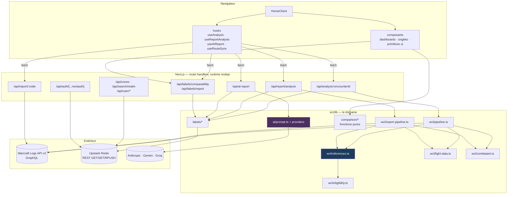
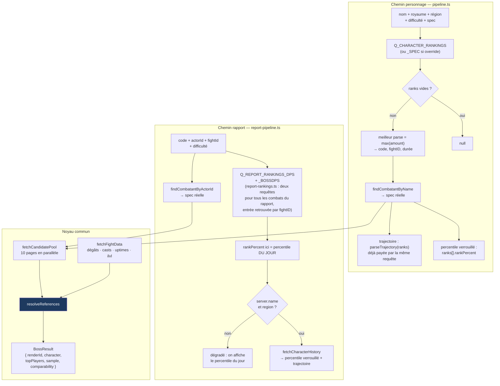
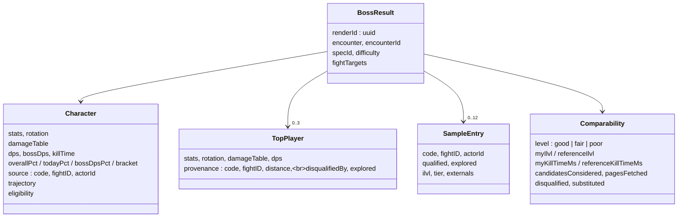

# Architecture

## Les couches



**Ce que la carte impose.** `references.ts` est le seul point où la comparabilité évolue —
filtrer sur l'ilvl, sur le set bonus, paralléliser, passer à une distribution : tout s'écrit
là et jamais dans les pipelines. Les deux pipelines ne doivent rester que de la plomberie
« trouver le sujet, appeler le noyau, assembler le `BossResult` ».

## Les deux chemins d'analyse



### Le piège des homonymes

Deux champs s'appellent `rankPercent` et ne mesurent pas la même chose :

| Source | Sens réel |
|---|---|
| `characterData…dps.ranks[].rankPercent` | Percentile **verrouillé au moment du kill** — celui que le joueur cite |
| `report.rankings…rankPercent` | Percentile **recalculé aujourd'hui** contre la population courante |

Le chemin rapport réconcilie les deux via `historical-parse.ts`, en retrouvant le parse par
`code` + `fightID`. Quand la réconciliation échoue (log privé, royaume absent de l'entrée,
panne WCL), l'écran retombe sur le percentile du jour — et c'est le seul cas où les deux
chemins annoncent des mesures différentes. Même chose pour la trajectoire, qui tombe avec.

## Le `BossResult` — le contrat unique

Tout l'affichage, tout le prompt IA et toute la capture se dérivent de cet objet.



`renderId` est un `randomUUID()` posé côté serveur à chaque analyse. Ce n'est pas un détail
de traçage : c'est **la seule clé de jointure du corpus** entre ce qui a été montré, ce qui a
été contesté, ce que le rapport IA a conseillé et ce que le lecteur en a pensé. Voir
[05-capture-de-donnees.md](05-capture-de-donnees.md).

## Inventaire des routes

| Route | Méthode | Rôle |
|---|---|---|
| `/api/analyze/[encounterId]` | POST | Un boss du chemin personnage. Appelle `analyzeBoss`, puis **attend** `recordExposure` avant de répondre |
| `/api/report/analyze` | POST | Le chemin rapport, pour tous les boss tués à la difficulté demandée |
| `/api/report/[code]` | GET | Métadonnées d'un rapport WCL : titre, combats, acteurs — sert à peupler le formulaire |
| `/api/ai-report` | GET | Quels fournisseurs ont une clé côté serveur |
| `/api/ai-report` | POST | Construit le prompt, écrit l'empreinte de conseil, ouvre le flux SSE |
| `/api/labels/comparability` | POST | Verdict « pas comparable » — authentifié, quota, validation champ par champ |
| `/api/labels/report` | POST | Retour du lecteur sur le rapport IA |
| `/api/zones`, `/api/search/realm` | GET | Données de formulaire |
| `/api/user/{characters,favourites,preferences,recents}` | GET/POST | Préférences persistées en Redis |
| `/api/auth/[...nextauth]` | — | NextAuth ; la whitelist vit dans le même Redis |

Toutes les routes d'analyse déclarent `export const runtime = 'nodejs'` : elles ont besoin de
`node:crypto` (`randomUUID`, le hachage salé) et de sessions NextAuth côté serveur.

**Une conséquence non évidente du serverless** : une promesse laissée en `void` meurt avec la
fonction. C'est pourquoi `recordExposure` et `recordAdvice` sont `await`ées *avant* la
réponse, même si elles ne peuvent jamais faire échouer l'analyse. Ce qui part sans être
capturé est définitivement perdu — le corollaire opérationnel de `CLAUDE.md`.

## Vérification

```
pnpm typecheck && pnpm test && pnpm lint && pnpm format:check
```

Les quatre passent avant tout commit ; le hook pre-commit les exécute.
