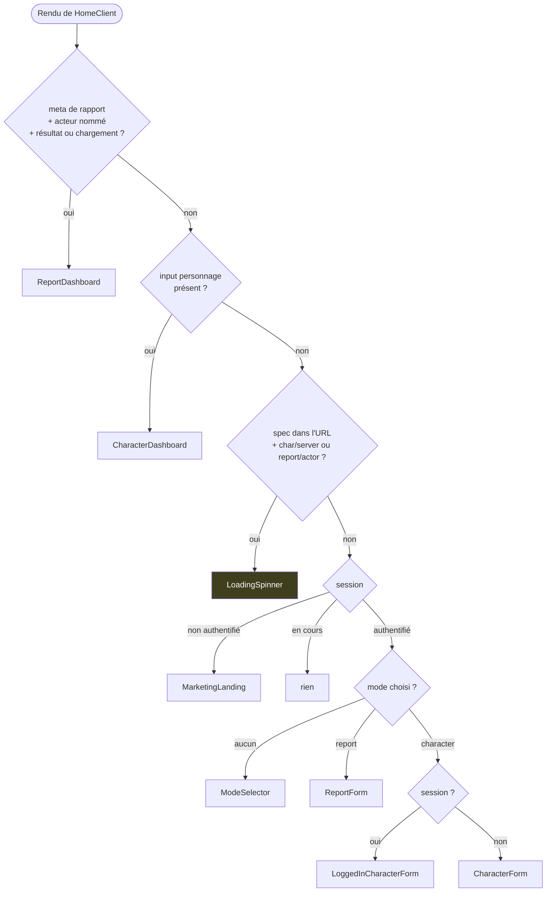
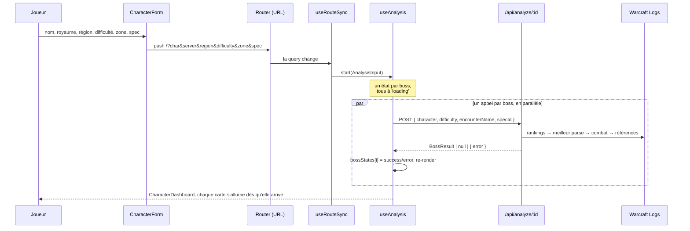
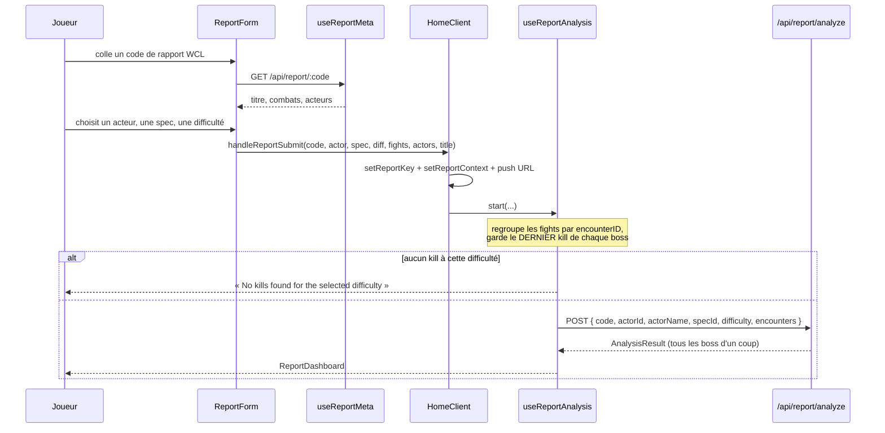
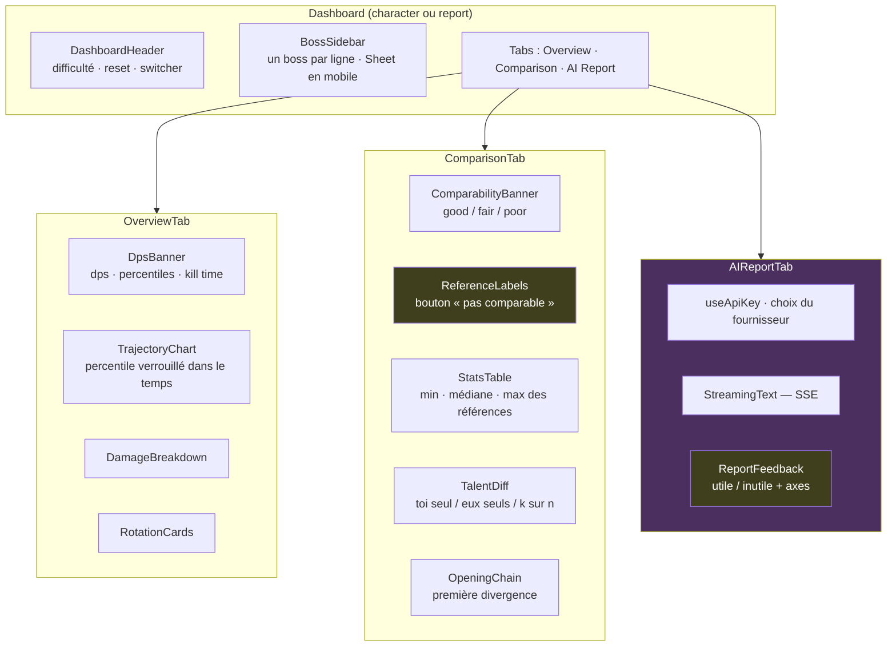

# Parcours d'interface

Tout passe par un composant unique, [`HomeClient`](../src/components/HomeClient.tsx), qui n'a
pas de routeur interne : **c'est la query string qui décide de l'écran**, et `useRouteSync`
qui déclenche les analyses quand elle change.

## Quel écran s'affiche

L'ordre des retours dans `HomeClient` est significatif — le premier qui matche gagne.

Le `LoadingSpinner` est gardé par la présence de `spec` dans l'URL, et ce garde-fou est
délibéré : sans `spec`, `useRouteSync` ne lance rien, et un spinner tournerait indéfiniment.
On retombe alors sur le formulaire, seul endroit où la spec se choisit.

## Chemin personnage, de bout en bout

Trois comportements de `useAnalysis` valent d'être connus :

- **Cache par difficulté.** `cacheRef` est indexé par palier ; passer Héroïque → Mythique →
  Héroïque réaffiche instantanément. Le cache est vidé dès que le nom ou le royaume change.
- **Le résultat n'est écrit que si la difficulté est toujours active.** `activeDiffRef`
  évite qu'une réponse tardive d'un palier abandonné écrase l'écran courant.
- **`switchBossSpec`** relance un seul boss avec `specIdOverride`, sans toucher aux autres.
  C'est le cas du joueur qui a joué deux specs sur le même palier.

## Chemin rapport

Différence structurelle avec le chemin personnage : **une seule requête pour tous les boss**,
donc pas d'affichage progressif — le tableau de bord attend le résultat complet. Le chemin
personnage, lui, tire un appel par boss et remplit l'écran au fur et à mesure.

Changer d'acteur (`handleSwitchActor`) relance l'analyse sur le même rapport ; la spec vient
de `reportResult.input.specId` ou du paramètre `spec` de l'URL, avec `0` en dernier recours —
mieux vaut afficher « spec inconnue » qu'affirmer une spec fausse.

## L'écran de résultats

Les deux tableaux de bord partagent `BossContentPanel`, donc les mêmes onglets.

Les deux blocs en jaune sont les seuls endroits où l'utilisateur **écrit** dans le corpus.
Tout le reste est en lecture.

L'onglet AI Report est le seul qui ne dépend pas d'un boss sélectionné : il envoie
l'`AnalysisResult` entier et le sélecteur de boss disparaît quand il est actif.

## Règles d'interface qui ont chacune coûté une correction

- **Le rouge (`text-danger`) est réservé aux erreurs.** Un écart aux références s'affiche en
  bleu (`text-deviation`) : une position dans une distribution n'est pas une faute. Le rouge
  doit rester disponible pour signaler une comparaison illégitime.
- **Tous les chiffres sont en `font-mono`**, y compris dans une phrase — on enveloppe le
  nombre, pas la phrase. Seule la prose du rapport IA fait exception (`font-sans`).
- **On ne surcharge jamais la taille d'une primitive via `className`.** Tailwind départage
  deux utilitaires sur la même propriété par leur ordre dans la feuille générée, pas par leur
  position dans la chaîne : la surcharge est silencieusement ignorée. Si aucune taille ne
  convient, on étend la primitive.
- **Aucun `style={{}}`**, sauf deux géométries calculées à l'exécution : les largeurs de
  barres dans `DamageBreakdown` et `RotationCards`.
- **`Sheet` est le traitement mobile des colonnes latérales** : il rend ses enfants
  directement à partir de `md`, et derrière un déclencheur en dessous. L'envelopper suffit,
  aucune media query à écrire.
