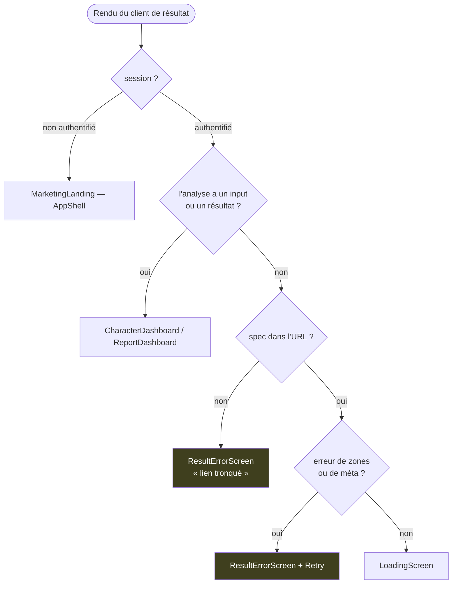
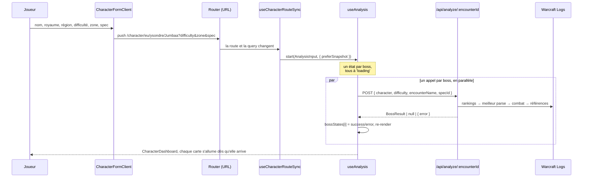
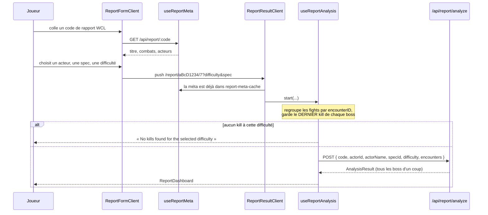
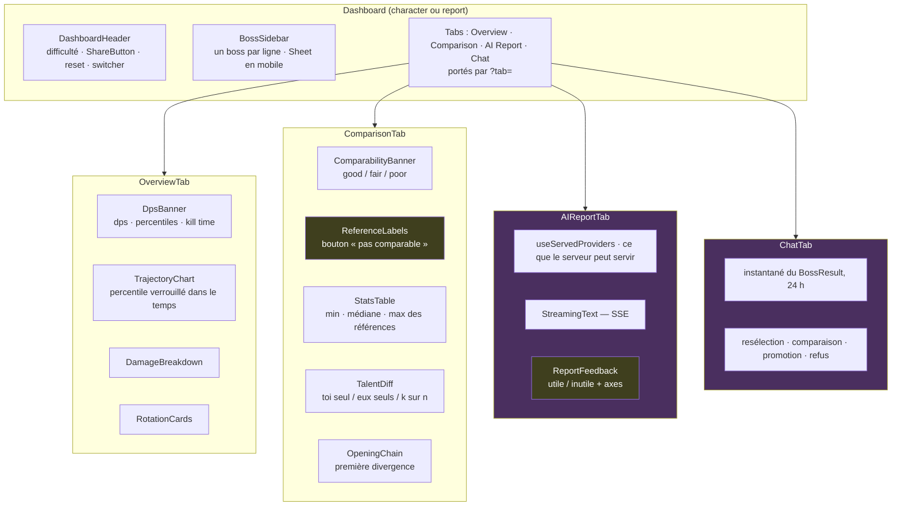

# Parcours d'interface

Chaque écran a une URL. Le contrat est écrit une fois dans
[`src/lib/routes.ts`](../src/lib/routes.ts) : **le chemin dit qui est analysé, la query dit
comment on le regarde.** Le chemin est stable — c'est lui qu'on colle dans un Discord, lui que
la carte de partage nomme. La query change à chaque clic et s'écrit en `replace` quand elle ne
mérite pas une entrée d'historique.

## La carte des routes

| URL | Écran | Client |
|---|---|---|
| `/` | La question du personnage | [`CharacterFormClient`](../src/components/forms/CharacterFormClient.tsx) |
| `/character` | Redirection permanente vers `/` | — |
| `/report` `/raid` `/pull` | Le formulaire du mode, atteignable sans être proposé | `src/components/forms/*FormClient.tsx` |
| `/demo` | Une analyse réelle et figée, sans compte | [`DemoScreen`](../src/components/demo/DemoScreen.tsx) |
| `/character/[region]/[realm]/[name]` | Résultat par personnage | [`CharacterResultClient`](../src/components/character/CharacterResultClient.tsx) |
| `/report/[code]/[actor]` | Résultat par rapport | [`ReportResultClient`](../src/components/report/ReportResultClient.tsx) |

Les deux routes de résultat portent la même query : `difficulty`, `zone`, `spec`, `boss`,
`tab`, `shared`. Trois points de conception s'y jouent :

- **`spec` est obligatoire.** Toutes les écritures d'URL la posent ; une URL qui en manque est
  tronquée. Lui donner un défaut lancerait une analyse entière sur une spec que personne n'a
  choisie — un rapport faux qui ne se signale pas. Les deux clients rendent un écran d'erreur à
  la place.
- **`difficulty` et `boss` restent en query** alors qu'ils identifient le résultat aussi
  sûrement que le personnage. En segment de chemin, chaque bascule remonterait le composant et
  viderait le `cacheRef` par palier d'`useAnalysis` — précisément ce qui rend le retour
  Héroïque → Mythique instantané.
- **`tab` est dans l'URL** parce qu'un lien collé pour montrer un écart doit ouvrir sur
  l'onglet Comparison, pas sur l'aperçu. `ai-report` et `chat` en font partie sans danger :
  ni l'un ni l'autre ne lance quoi que ce soit au montage, ouvrir un lien sur eux ne dépense
  rien.

Le pull n'a pas de route de résultat : sa comparaison vit dans le formulaire, faute d'une
identité de pull qui tienne dans un chemin.

### L'entrée est une question, pas un choix de mode

`/` posait d'abord le choix entre quatre modes. Un nouveau venu ne peut pas le faire : il ne
sait pas encore ce que l'outil rend, et trois des quatre modes supposent un code de rapport
qu'il n'a pas sous la main. `/` **est** donc maintenant la question du personnage —
`CharacterFormClient`, sans détour — et `/character` s'y redirige, pour que les liens déjà
collés arrivent au bon endroit sans qu'un même écran ait deux URL à indexer.

Les trois autres modes n'ont pas disparu : [`OtherModesLine`](../src/components/forms/OtherModesLine.tsx)
les pose en une ligne sous le formulaire. Atteignables pour qui les connaît, jamais proposés à
froid. Leurs routes déclarent `noindex` : un formulaire vide ne vaut pas un résultat de
recherche.

### La porte, la carte, et les anciens liens

[`AppShell`](../src/components/AppShell.tsx) enveloppe toutes les pages sauf une, routes de
résultat comprises. L'instantané de `result-snapshot.ts` n'est lisible que par un utilisateur
authentifié : une page publique rendant une analyse dérivée de Warcraft Logs ferait de
LogLense une publication concurrente d'Archon. Un lien partagé s'ouvre donc sur la page
d'accueil tant que le destinataire n'est pas connecté — c'est le comportement voulu.

L'exception est `/demo`, **la seule route rendue hors de la porte et la seule qui s'indexe avec
son contenu.** Ce que la frontière protège, ce sont les analyses vivantes : rendre à la demande,
pour n'importe qui, ce que Warcraft Logs nous répond. `/demo` ne le fait pas — il rend une
fixture du dépôt ([`src/lib/demo/boss-result.ts`](../src/lib/demo/boss-result.ts), produite par
`scripts/build-demo-fixture.ts`), anonymisée, sans une requête à WCL ni à Redis. Les chiffres
sont ceux d'un vrai `analyzeBoss` : un exemple fabriqué contredirait ce que le produit affirme.
Les deux onglets qui appellent un modèle en direct s'ouvrent et disent en une ligne ce qui leur
manque, plutôt que d'être cachés — le rapport comme le chat exigent une session, et c'est une
position produit, pas une limite de cette page.

Les routes de résultat déclarent un `generateMetadata`, ce qui donne à un lien collé une carte
dans Discord ou sur Reddit. [`share-meta.ts`](../src/lib/share-meta.ts) en pose les deux
règles : **aucun chiffre dérivé** (la carte porte notre position, pas un dps), et **aucune
requête** — le robot qui la demande n'a pas de session, donc ni WCL, ni Redis, ni `fetch`,
seulement les tables statiques. `robots: noindex` suit la même frontière que l'instantané.

Les anciens liens `/?char=…` et `/?report=…` sont traduits côté serveur dans
[`src/app/page.tsx`](../src/app/page.tsx) via `legacyResultPath` : le destinataire arrive
directement sur la nouvelle URL.

## Quel écran s'affiche sur une route de résultat

L'ordre des retours dans les deux clients est significatif — le premier qui matche gagne.

Sans `spec`, le hook de synchronisation ne lance rien : un spinner tournerait indéfiniment. On
le dit à l'écran, avec un retour vers le formulaire — seul endroit où la spec se choisit.

## Chemin personnage, de bout en bout

Le formulaire ne fait que naviguer : il ne passe aucun état en mémoire au résultat. C'est
l'URL qui relance l'analyse, jamais un gestionnaire — un lien collé et un clic sur
« Mythique » suivent donc exactement le même chemin.

Trois comportements de `useAnalysis` valent d'être connus :

- **Cache par difficulté.** `cacheRef` est indexé par palier ; passer Héroïque → Mythique →
  Héroïque réaffiche instantanément. Le cache est vidé dès que le nom ou le royaume change.
- **Le résultat n'est écrit que si la difficulté est toujours active.** `activeDiffRef`
  évite qu'une réponse tardive d'un palier abandonné écrase l'écran courant.
- **`switchBossSpec`** relance un seul boss avec `specIdOverride`, sans toucher aux autres.
  C'est le cas du joueur qui a joué deux specs sur le même palier.

### Le lien partagé et `shared=1`

[`ShareButton`](../src/components/shared/ShareButton.tsx) copie l'URL courante en y posant
`shared=1`. La marque n'est pas une frontière de sécurité — la forger n'ouvre rien, le
destinataire doit être connecté comme n'importe quel appelant. Elle dit seulement que cette
ouverture-ci accepte l'instantané du rendu partagé (`preferSnapshot`) plutôt qu'une salve WCL
neuve. Sans elle, un raideur qui relance son analyse pendant la soirée verrait la pull d'il y
a deux heures.

`shared` reste **hors** de la clé de dédoublonnage de `useCharacterRouteSync`, et n'est honorée
qu'à la première analyse de la session : les écritures d'URL qui suivent traînent la query
courante, or un changement de palier ou de personnage est une demande neuve, pas l'ouverture
d'un lien.

## Chemin rapport

Les combats, les acteurs et le titre ne voyagent pas dans l'URL : ils n'y tiendraient pas.
[`report-meta-cache`](../src/lib/report-meta-cache.ts) les porte d'un écran à l'autre — un
cache de module, donc vivant au-delà du démontage du formulaire. Le lecteur qui arrive par un
lien collé n'en bénéficie pas : la méta est redemandée une fois, à Warcraft Logs.

Deux différences structurelles avec le chemin personnage :

- **Une seule requête pour tous les boss**, donc pas d'affichage progressif — le tableau de
  bord attend le résultat complet. Le chemin personnage tire un appel par boss et remplit
  l'écran au fur et à mesure.
- **Un changement de palier fait tomber `boss`** : la liste des boss d'un rapport est celle
  des kills à ce palier-là, donc elle change avec lui. Sur le chemin personnage, `boss`
  survit — la liste vient de la zone, la même à tous les paliers.

## L'écran de résultats

Les deux tableaux de bord partagent `BossContentPanel`, donc les mêmes onglets. Le panneau
**n'a plus d'état d'onglet** : il reçoit `activeTab` et rend `onTabChange`, et ce sont les
clients de résultat qui réécrivent l'URL — en `replace`, comme le rail de boss. Passer d'un
onglet à l'autre n'est pas une navigation, c'est un regard.

Les deux blocs en jaune sont les seuls endroits où l'utilisateur **écrit** dans le corpus.
Tout le reste est en lecture.

Les onglets AI Report et Chat sont les seuls à ne pas dépendre d'un boss sélectionné : le
sélecteur de boss disparaît quand l'un des deux est actif. Ni l'un ni l'autre n'appelle un
modèle au montage — ils attendent un clic, ce qui est la condition pour que `tab` puisse vivre
dans une URL partageable.

## Règles d'interface qui ont chacune coûté une correction

- **Le rouge (`text-danger`) est réservé aux erreurs.** Un écart aux références s'affiche en
  bleu (`text-deviation`) : une position dans une distribution n'est pas une faute. Le rouge
  doit rester disponible pour signaler une comparaison illégitime.
- **Tous les chiffres sont en `font-mono`**, y compris dans une phrase — on enveloppe le
  nombre, pas la phrase. Seule la prose du rapport IA fait exception (`font-sans`).
- **On ne surcharge jamais la taille d'une primitive via `className`.** Tailwind départage
  deux utilitaires sur la même propriété par leur ordre dans la feuille générée, pas par leur
  position dans la chaîne : la surcharge est silencieusement ignorée. Si aucune taille ne
  convient, on étend la primitive.
- **Aucun `style={{}}`**, sauf trois géométries calculées à l'exécution : les largeurs de
  barres dans `DamageBreakdown` et `TalentDiff`, la position de la bande et du marqueur dans
  `RotationCards`.
- **`Sheet` est le traitement mobile des colonnes latérales** : il rend ses enfants
  directement à partir de `md`, et derrière un déclencheur en dessous. L'envelopper suffit,
  aucune media query à écrire.
