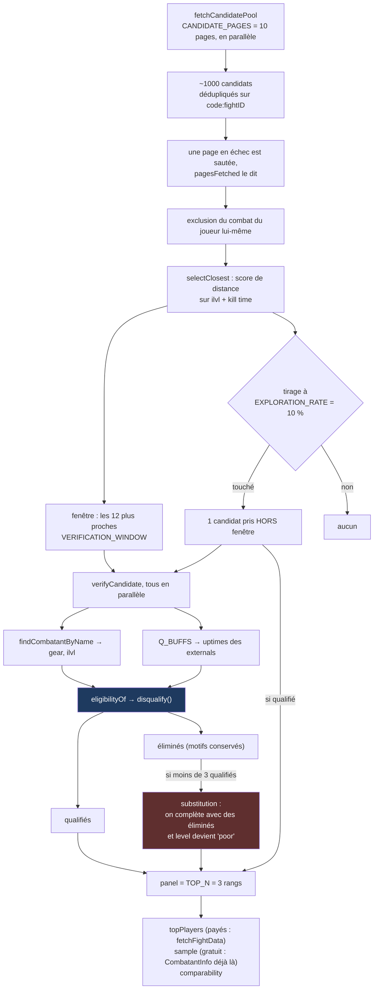
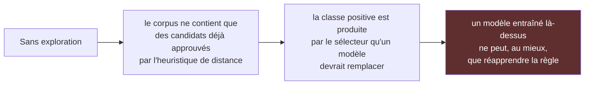
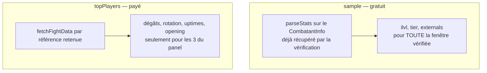
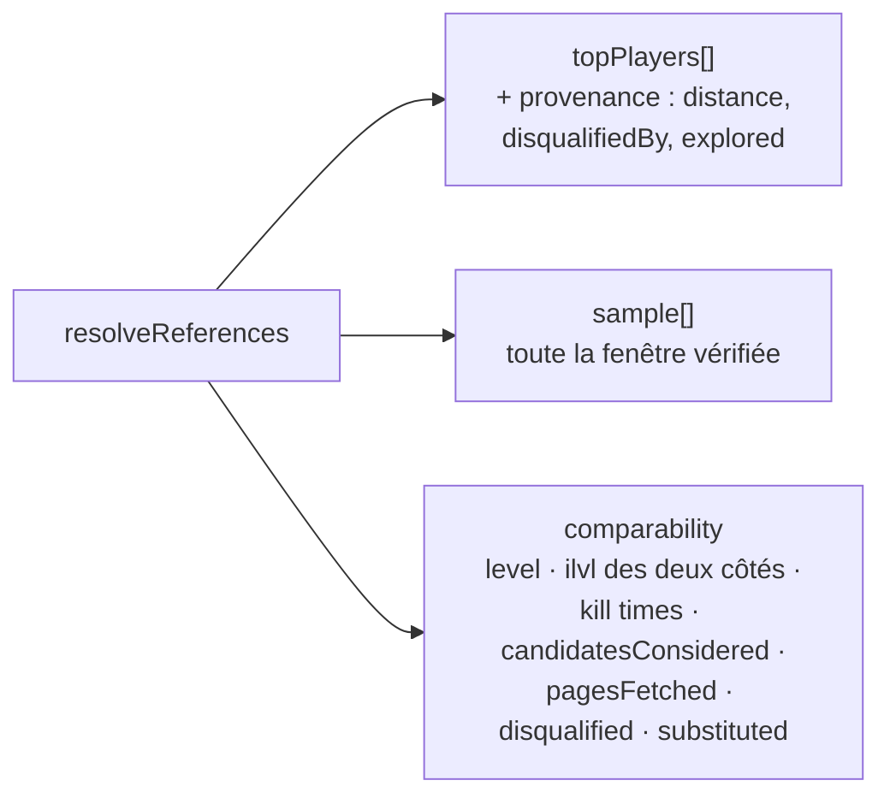

# Le moteur de comparabilité

Deux logs sont comparables si l'écart de DPS s'explique par **le jeu** et non par **le
contexte** — kill time, ilvl, set bonus, buffs externes reçus. C'est le cœur du produit :
tout le reste (tableaux, prose IA) présente ce que cette sélection a décidé.

Tout tient dans [`src/lib/wcl/references.ts`](../src/lib/wcl/references.ts). Les pipelines
n'en connaissent que deux fonctions : `fetchCandidatePool` et `resolveReferences`.

## La chaîne complète



## Les critères éliminatoires

Un seul principe couvre les deux : **une référence n'est éliminée que si elle a été aidée
plus que le joueur.** Un candidat avec un set bonus inférieur, ou moins d'externals, apprend
encore quelque chose — il a battu le joueur avec moins. L'inverse, non : l'écart qu'il montre
appartient à son raid, pas à lui.

| Motif | Règle exacte | Où |
|---|---|---|
| `set-bonus` | Le bonus du candidat (4p / 2p / rien) est **strictement supérieur** à celui du joueur. Un `null` d'un côté ou de l'autre **ne disqualifie pas** | `eligibility.ts` |
| `external` | `candidate.externalUptime > mine.externalUptime + EXTERNAL_TOLERANCE (10 pts)` | `eligibility.ts` |

Les externals sont reconnus **par `guid`, jamais par nom** : les noms sont localisés dans le
rapport d'un raid non anglophone, les identifiants non. La liste est volontairement courte —
uniquement les buffs offensifs *ciblés*, ceux qu'un raid donne à un joueur et pas à un autre :

```
10060  Power Infusion      395152 Ebon Might
410089 Prescience          413984 Shifting Sands
```

Les buffs de raid que tout le monde a ne faussent pas une comparaison et ne sont pas là.

`tierPieces = null` signifie **inconnu** (le combat ne porte aucun équipement), jamais zéro.
Lire `null` comme zéro éliminerait sur un trou dans le rapport, et c'est la seule direction
qui ne se rattrape pas.

## Deux mécanismes qui se dénoncent eux-mêmes

### La substitution

Quand moins de `TOP_N` candidats survivent à la vérification, le panel est complété par des
candidats **éliminés** — et `comparability.level` passe à `poor`. La bannière l'affiche.
Le produit préfère montrer une comparaison faible en le disant plutôt que d'afficher un écran
vide ou, pire, une comparaison faible en silence.

### L'exploration



D'où `EXPLORATION_RATE = 0.1` : un rendu sur dix cède le dernier rang du panel à un candidat
tiré **hors** de la fenêtre de distance. C'est la seule entrée dont la présence ne s'explique
pas par la règle, donc la seule qui dise quelque chose sur ce que la règle écarte. Le prix —
un rang moins proche, une fois sur dix — est visible et assumé : la bannière voit la référence
explorée comme les autres et le dit, et le corpus la marque `explored: true` pour qu'un
entraînement ne la confonde jamais avec les autres.

## Ce qui est payé et ce qui est gratuit



C'est ce qui permet d'écrire dans le corpus **toute la fenêtre vérifiée** (12 entrées) alors
que l'écran n'en montre que 3 : le jugement porté sur une référence écartée de l'affichage
est de l'information, et il ne coûte rien de plus.

## Les seuils, et pourquoi ils valent ce qu'ils valent

| Constante | Valeur | Justification |
|---|---|---|
| `CANDIDATE_PAGES` | 10 | ~1000 candidats, dix requêtes en parallèle |
| `VERIFICATION_WINDOW` | 12 | Assez large pour qu'il reste `TOP_N` survivants après éliminations, assez étroit pour que la vérification tienne en un aller-retour |
| `TOP_N` | 3 | Le panel affiché |
| `ILVL_TOLERANCE` | 4 | Au-delà, une référence cesse d'être instructive |
| `KILL_TIME_TOLERANCE` | 0.2 | 20 % d'écart de durée |
| `EXTERNAL_TOLERANCE` | 10 pts | Un Power Infusion incident est du bruit ; un Ebon Might plein combat est un autre combat |
| `EXPLORATION_RATE` | 0.1 | Voir ci-dessus |
| `OPENING_LENGTH` | 12 casts | Assez pour couvrir une fenêtre de burst et sa montée ; au-delà, la chaîne devient une liste de priorités, que le tableau agrégé dit déjà |
| `OPENING_EVENT_LIMIT` | 40 | Plus grand que `OPENING_LENGTH` : les `begincast` sont entrelacés puis jetés |

## Ce qui sort



`comparability` n'est pas un affichage : c'est un instantané que le corpus conserve tel quel,
parce que le vivier du jour n'existera plus dans un mois et ne se reconstitue pas.
