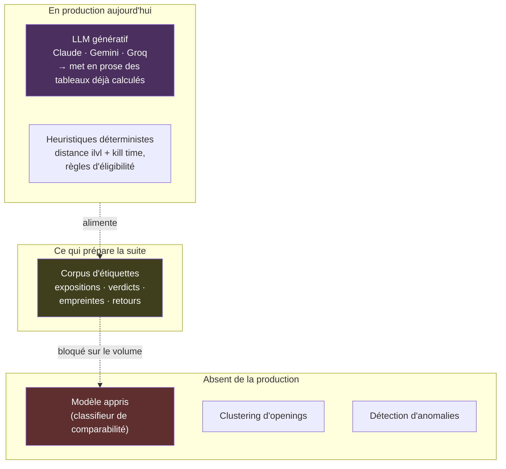
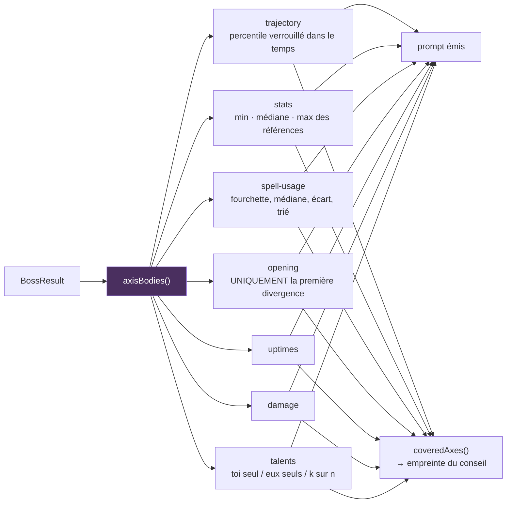
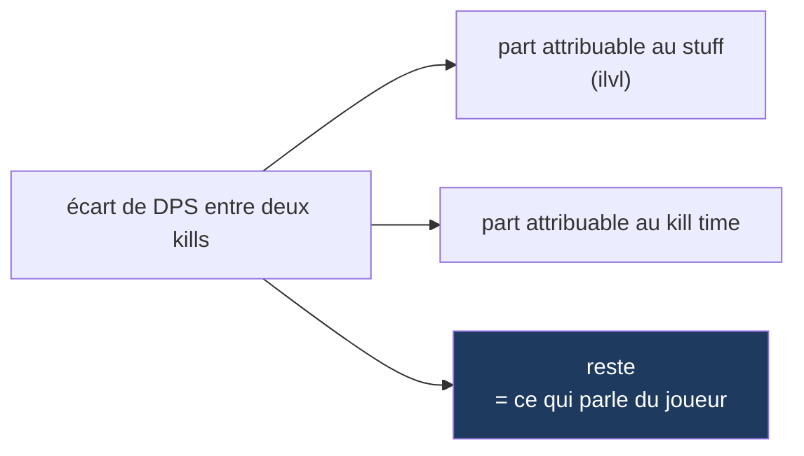

# Où l'IA intervient — et où le ML n'intervient pas

## L'état, sans détour



**Aucun ML n'est exécuté.** Le seul modèle appelé est un LLM génératif, et il ne fait
qu'écrire. La tâche 8 de `PRODUCT_CONTEXT.md` — le classifieur entraîné sur le corpus — a été
sortie de la v1 le 7 août 2026 et reste bloquée sur le volume de données.

**Conséquence assumée, et datée.** Le test anti-gadget de `CLAUDE.md` dit : retirez l'IA, si
le produit tient encore debout, c'était un gadget. Retirez le rapport IA de LogLense : les
onglets Overview et Comparison tiennent debout. Le rapport IA **est** un gadget au sens de la
contrainte n°2, et la v1 ne la satisfait donc pas. C'est une renonciation documentée, pas un
oubli. Ce qui est structurant — la sélection de logs comparables — est aujourd'hui heuristique
et non appris.

## Le chemin du rapport IA

```mermaid
sequenceDiagram
    participant U as Onglet AI Report
    participant H as useAIReport
    participant R as POST /api/ai-report
    participant P as buildAnalysisPrompt
    participant A as recordAdvice
    participant M as Fournisseur

    U->>H: start(result, apiKey, provider, model?)
    H->>R: POST AnalysisResult<br/>en-têtes x-ai-key / x-ai-provider / x-ai-model
    R->>R: clé = env OU en-tête ; sinon 401
    R->>P: buildAnalysisPrompt(result, talentNodes)
    P-->>R: tableaux de comparaison en texte
    R->>A: await recordAdvice(boss, { provider, model })
    Note over A: attendue, pas en void :<br/>une promesse orpheline meurt<br/>avec la fonction serverless
    R->>M: provider.stream(prompt, SYSTEM_PROMPT)
    loop chunks
        M-->>R: { type: 'text' } | { type: 'usage' }
        R-->>H: data: "…"  /  data: {"_meta":"usage",…}
        H-->>U: texte accumulé, rendu au fil de l'eau
    end
    R-->>H: data: "[DONE]"
    U->>U: ReportFeedback devient disponible
```

### La couture des fournisseurs

Une interface de treize lignes, [`ai/provider.ts`](../src/lib/ai/provider.ts), sépare tout le
reste du choix du modèle :

```ts
export type AIStreamChunk =
  | { type: 'text'; content: string }
  | { type: 'usage'; data: UsageData };

export interface AIProvider {
  stream: (prompt: string, systemPrompt: string) => ReadableStream<AIStreamChunk>;
}
```

Trois implémentations — `ClaudeProvider`, `GeminiProvider`, `GroqProvider` — et le choix se
fait par en-tête, avec `claude` par défaut côté route. La clé vient de l'environnement
(`ANTHROPIC_API_KEY`, `GEMINI_API_KEY`, `GROQ_API_KEY`) ou, à défaut, de l'en-tête `x-ai-key`
fourni par l'utilisateur. `GET /api/ai-report` dit à l'interface quels fournisseurs sont déjà
configurés côté serveur, pour ne pas demander une clé inutilement.

## Ce que le modèle reçoit

[`ai/prompt.ts`](../src/lib/ai/prompt.ts) ne transmet **jamais** de données brutes WCL : il
transmet des tableaux comparatifs déjà réduits.



`axisBodies()` est délibérément **la source unique** du prompt et de l'empreinte. C'est ce qui
garantit qu'un « axe conseillé » enregistré dans le corpus correspond exactement à ce que le
modèle a réellement eu sous les yeux — sinon les deux dériveraient et la confrontation
« conseillé / jugé inutile » ne voudrait plus rien dire.

Le `SYSTEM_PROMPT` impose une procédure en sept étapes (type de combat → plus gros écart
d'usage de sort → répartition des dégâts → stats → talents → opening → trajectoire) et un
format de sortie en sept points. `PROMPT_VERSION = 2` est enregistré avec chaque empreinte :
deux rapports produits sous deux consignes différentes ne se comparent pas.

Deux garde-fous sur ce qui est transmis :

- **L'opening ne remonte que sa première divergence.** La suite d'une chaîne de casts est une
  liste de priorités, que le tableau agrégé dit déjà mieux.
- **La courbe de trajectoire est donnée au modèle, mais il lui est interdit de la sur-lire** —
  l'axe tracé est le *percentile verrouillé*, pas le DPS, précisément parce que le DPS monte
  tout seul avec l'ilvl du palier.

## La séparation stuff / joueur

Un module de comparaison pur, `comparison/trend.ts`, découpe la variation de DPS entre kills :



C'est le seul endroit du produit où une progression est attribuée plutôt que constatée. Ce
calcul est déterministe ; le LLM le reçoit déjà fait.

## Classement de la valeur potentielle de l'IA

Repris de `PRODUCT_CONTEXT.md`, du plus défendable au moins :

| Rang | Usage | Statut |
|---|---|---|
| 1 | Sélection de logs comparables | **Heuristique en production**, ML visé en v2 |
| 2 | Clustering d'openings | Non implémenté |
| 3 | Détection d'anomalies | Non implémenté |
| 4 | Rédaction du rapport en langage naturel | **En production — défendabilité nulle** |

L'inversion entre valeur et implémentation est exactement le problème que la v2 doit résoudre :
ce qui est en production est ce qui se réplique en une après-midi, et ce qui se défend n'est
pas encore appris.

## Ce qui bloque la v2

Le classifieur a besoin de volume d'étiquettes. Le produit capture donc dès aujourd'hui —
voir [05-capture-de-donnees.md](05-capture-de-donnees.md) — parce que **repousser le calcul
est acceptable, repousser la capture ne l'est pas** : le calcul se rattrape, les données non
capturées sont perdues.
