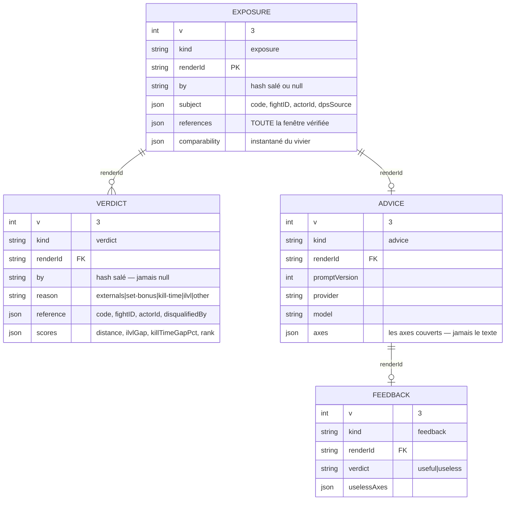
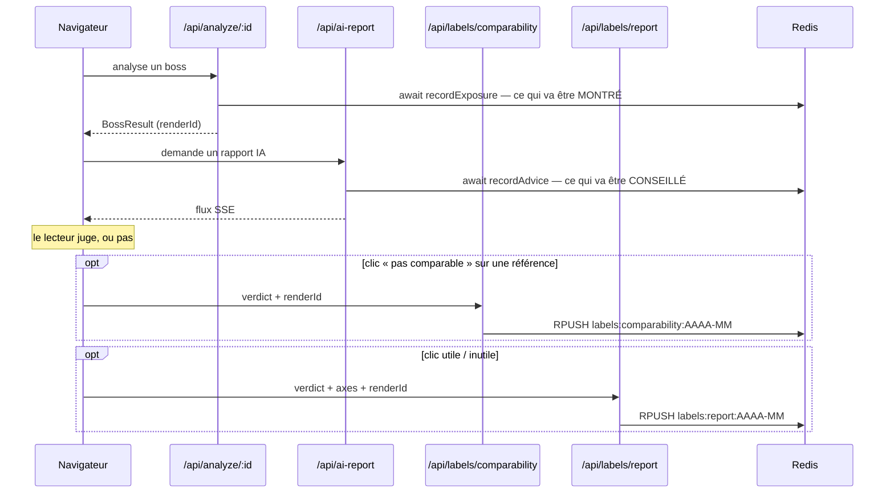
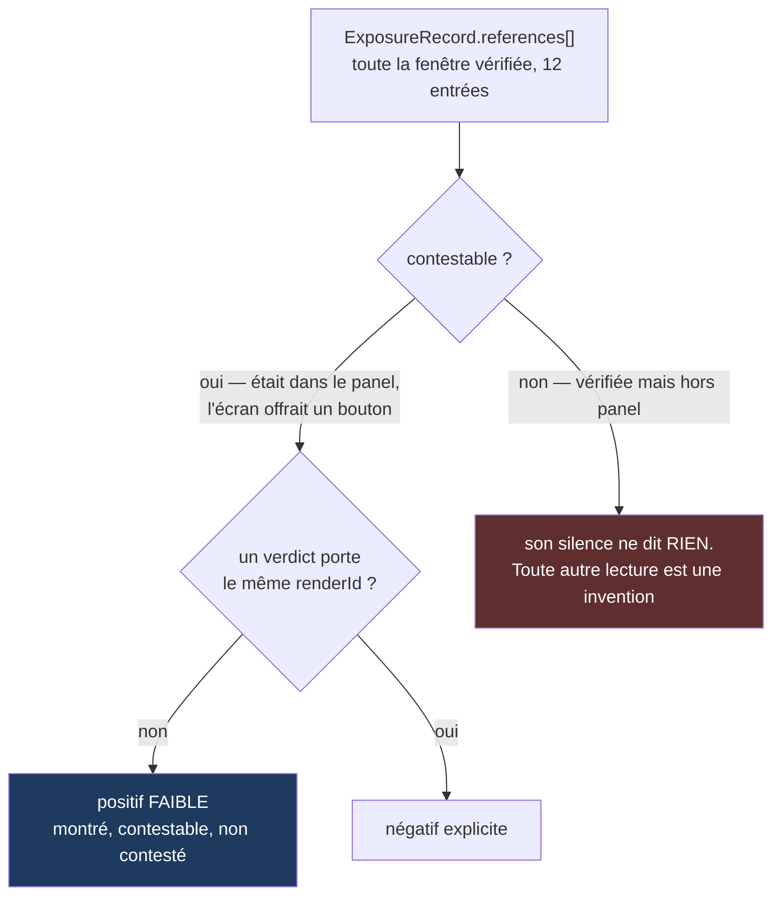
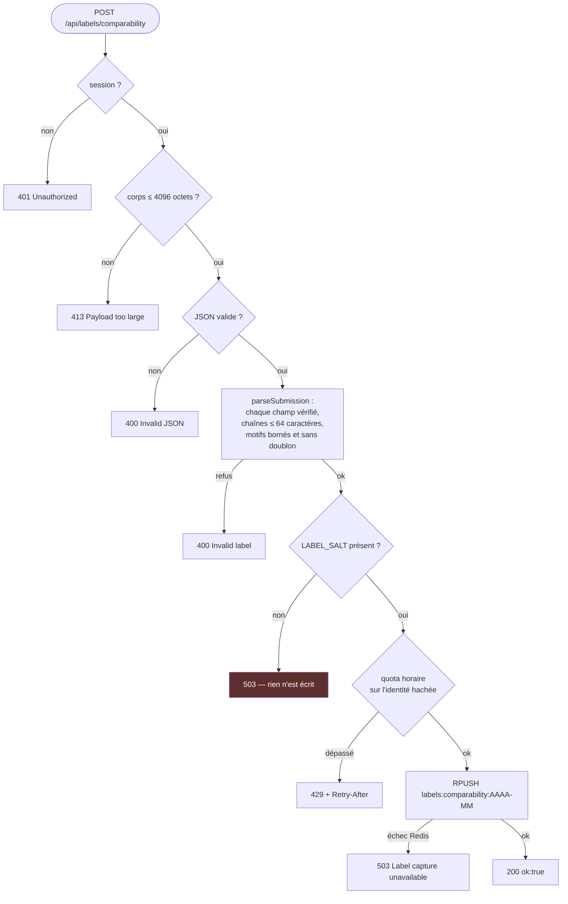

# Le corpus d'étiquettes

Le seul actif que LogLense ne peut pas reconstituer plus tard. Le vivier de candidats d'un
boss n'existera plus dans un mois ; les jugements portés dessus, si — à condition d'avoir été
écrits au moment où ils ont eu lieu.

## Les quatre enregistrements et leur clé commune



`renderId` — un `randomUUID()` posé côté serveur sur chaque `BossResult` — est **la seule clé
du corpus**. Un enregistrement sans lui ne se joint à rien : les deux endpoints le refusent.

## Quand chaque enregistrement naît



Les deux écritures serveur sont **`await`ées avant la réponse**, et c'est intentionnel : sur
un runtime serverless, une promesse laissée en `void` part avec la fonction, et c'est toute
la classe positive qui disparaît. Elles n'échouent jamais bruyamment non plus — le rapport ne
dépend pas de sa capture, mais la capture ne coûte jamais l'analyse.

## Pourquoi l'exposition existe

C'est la classe positive que le corpus n'avait pas. Les verdicts « pas comparable » ne
capturent qu'un refus ; sans trace de ce qui a été **montré et non refusé**, un modèle
n'apprendrait que sur des négatifs.



Le champ `explored` marque la référence tirée hors de la fenêtre de distance. Un entraînement
qui la confondrait avec les autres n'apprendrait que le biais du sélecteur — voir
[03-comparabilite.md](03-comparabilite.md).

## Ce que le corpus ne portera jamais

| Exclu | Raison |
|---|---|
| Les noms de tiers | §5c des CGU RPGLogs. Les références sont désignées par `code:fightID:actorId`, jamais par nom |
| L'e-mail ou le nom de session | Seulement `SHA-256(identifiant + LABEL_SALT)`. Si `LABEL_SALT` manque, l'endpoint répond `503` et **n'écrit rien** — échec fermé, pas identité en clair |
| La prose du rapport IA | Sorties de modèle : incomparables entre elles, elles gonflent une clé qu'on ne peut pas nettoyer, et elles peuvent recopier des noms de tiers. Les axes couverts disent tout ce qu'un modèle peut apprendre : *sur quoi* on a parlé, pas *comment* |
| Le moindre champ libre | Un « dites-nous pourquoi » ouvre, dans un corpus en écriture seule, un canal de données personnelles qu'aucun plafond de longueur ne referme |
| Les mesures WCL recopiées | Depuis `v: 3`, ce sont des pointeurs : les mesures se réhydratent depuis WCL. Exception : les **écarts signés** (`scores`), qui sont des jugements de LogLense sur un vivier disparu et ne se recalculent pas |

## Défenses de l'endpoint d'étiquettes



Trois choix qui méritent d'être explicites :

- **Le quota se compte sur l'identité hachée, jamais sur l'IP.** C'est un compte qui écrit
  dans le corpus, et c'est un compte qu'un flot de verdicts fabriqués empoisonnerait.
- **Aucune réponse ne prétend qu'une écriture a eu lieu si elle n'a pas eu lieu.** Un clic
  perdu est une donnée perdue.
- **Les champs que le serveur possède — `v`, `kind`, `at`, `by` — ne sont jamais repris de
  l'entrée.** Le client ne choisit ni qui il est ni quand cela s'est produit.

Le plafond de 4096 octets sur le corps existe parce que les route handlers App Router n'en
appliquent aucun par défaut : une session valide pourrait pousser en boucle des mégaoctets
dans la clé du mois. Saturer Upstash ne détruirait pas que le corpus — c'est le même client
qui sert la whitelist d'authentification.

## Stockage

Une liste Redis par mois et par type, en append-only :

```
labels:exposure:2026-08        expositions
labels:comparability:2026-08   verdicts « pas comparable »
labels:report:2026-08          empreintes de conseil ET retours de lecteur
```

Bornées par construction, lisibles sans index. Le champ `v` n'est pas décoratif : le corpus
survivra à plusieurs versions du code, et sans lui on ne saurait plus dans un an ce que
signifiaient les enregistrements d'aujourd'hui. `v: 3` marque le passage aux pointeurs — les
enregistrements `2` portent des mesures WCL recopiées, les `3` les réhydratent.

[`redis.ts`](../src/lib/redis.ts) est un client REST Upstash minimal : `GET`, `SET`, `RPUSH`.
C'est la seule persistance du produit.
