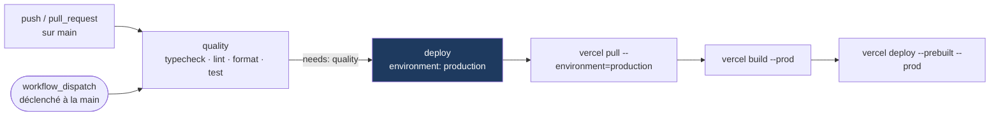

# Déploiement

Ce fichier existe parce que le produit était **déployable par son auteur et par personne
d'autre** : la procédure vivait dans une tête, et le dépôt n'en portait aucune trace. Il
décrit ce qu'il faut créer une fois, ce qui se passe à chaque mise en production, et ce que
coûte l'admission d'un testeur.

Le dépôt n'est lié à aucun projet Vercel : il n'y a ni `vercel.json`, ni `.vercel/` (le
dossier est ignoré — il porte l'identité du projet de celui qui déploie, pas du dépôt). Ce
qui suit décrit donc comment **créer** le déploiement, pas comment rejoindre un déploiement
existant.

## La plateforme n'est pas un choix libre

Trois endroits du code lisent `VERCEL_ENV`, et tous les trois se taisent quand la variable
est absente :

| Fichier | Ce qu'il décide | Sans `VERCEL_ENV=production` |
|---|---|---|
| `src/instrumentation.ts` | Lance `assertProductionEnv()` au démarrage | Le garde ne s'exécute jamais |
| `src/lib/blizzard-credentials.ts` | Quelle paire Battle.net est utilisée | La paire `_DEV`, dont la redirect URI pointe sur `localhost` |
| `next.config.ts` | La valeur de `NEXTAUTH_URL` à la construction | `NEXTAUTH_URL_DEV`, donc `http://localhost:3000` |

Les trois échouent dans le même sens : silencieusement, vers le développement. Un
déploiement hébergé ailleurs que sur Vercel démarre sans être vérifié, puis renvoie chaque
retour de Battle.net sur une origine inexistante. **Déployer sur Vercel, ou poser
`VERCEL_ENV=production` à la main** — mais jamais la laisser vide en production.

## Ce que fait le workflow

`.github/workflows/ci.yml` porte deux jobs :



Trois propriétés valent d'être dites, parce qu'elles sont le seul intérêt du job :

1. **`needs: quality`** — le déploiement ne peut pas contourner les quatre portes. Elles
   sont rejouées sur la référence choisie au moment du déclenchement, pas héritées d'une
   exécution passée.
2. **`if: github.event_name == 'workflow_dispatch'`** — aucun déploiement automatique au
   push. La mise en production est une décision, et elle reste lisible dans l'historique des
   exécutions.
3. **`vercel pull` avant `vercel build`** — la construction lit `NEXTAUTH_URL_PROD`
   (`next.config.ts`). Sans l'étape de rapatriement, elle construit sans, et l'application
   déployée renvoie ses utilisateurs sur `localhost`.

## Première mise en production

Dans cet ordre — chaque étape produit ce dont la suivante a besoin.

### 1. Créer le projet Vercel et le lier

```bash
npm install --global vercel@latest
vercel link
```

`vercel link` écrit `.vercel/project.json`, qui contient `orgId` et `projectId` : ce sont
les deux valeurs à recopier dans les secrets GitHub à l'étape 4.

### 2. Couper le déploiement automatique de l'intégration Git

Dans les réglages Vercel du projet, section *Git* : désactiver le déploiement automatique de
production (ou ne pas connecter le dépôt du tout). Sinon il existe **deux** chemins de mise
en production, et celui de Vercel ne passe par aucune des quatre portes.

### 3. Créer le second client Battle.net

Le client de développement ne peut pas servir : sa redirect URI est `localhost`. Sur
<https://develop.battle.net/>, créer un second client dont la redirect URI est
`https://<domaine-déployé>/api/auth/callback/battlenet`. Ses identifiants alimentent
`BLIZZARD_CLIENT_ID_PROD` et `BLIZZARD_CLIENT_SECRET_PROD`.

Warcraft Logs et Upstash ne demandent pas ce dédoublement : le même client et la même base
servent les deux environnements.

### 4. Renseigner les variables et les secrets

Côté **Vercel**, portée *Production* : la liste complète et son statut par environnement est
dans le [README](../README.md#3-configure-environment-variables), qui fait autorité. Ne sont
reprises ici que celles qui ont un piège à la mise en production.

| Variable | Le piège |
|---|---|
| `NEXTAUTH_URL_PROD` | Lue à la **construction**. La changer impose de reconstruire — repromouvoir un déploiement existant garde l'ancienne valeur |
| `BLIZZARD_CLIENT_ID_PROD` / `_SECRET_PROD` | Le garde vérifie la présence, jamais la validité. Une mauvaise paire démarre sans erreur et échoue à la première connexion |
| `BETA_ALLOWLIST` | **Absente de la liste du garde**, et pourtant indispensable : le déploiement démarre, puis refuse toutes les connexions, y compris la vôtre |
| `ADMIN_BATTLETAGS` | Absente du garde elle aussi. Sans elle, `/admin` répond `404` à tout le monde — donc plus personne ne peut rouvrir la porte depuis l'interface |
| `LABEL_SALT` | Sale l'identifiant anonyme du corpus. La changer coupe la continuité : les enregistrements écrits avant ne se rattachent plus à ceux d'après |
| `ENABLE_DEV_SESSION` | Doit être **absente**. La poser à `0` ne la neutralise pas : le garde teste la présence d'une valeur non vide, et `'0'` en est une |

Côté **GitHub**, dans *Settings → Secrets and variables → Actions* :

| Secret | D'où il vient |
|---|---|
| `VERCEL_TOKEN` | <https://vercel.com/account/tokens> |
| `VERCEL_ORG_ID` | `.vercel/project.json`, champ `orgId` |
| `VERCEL_PROJECT_ID` | `.vercel/project.json`, champ `projectId` |

Créer aussi l'environnement GitHub nommé `production` (*Settings → Environments*) : le job
`deploy` le déclare, et c'est là qu'une approbation manuelle se branche si elle devient
souhaitable.

### 5. Déclencher

*Actions → CI → Run workflow*, sur `main`. Le job `quality` passe d'abord ; `deploy` ne
démarre que s'il est vert.

## Admettre un testeur bêta

Ça se fait sur `/admin`, sans déploiement. La page est réservée aux battletags de
`ADMIN_BATTLETAGS` et répond `404` à tous les autres — y compris connectés : dire « interdit »
confirmerait qu'il y a une liste d'administrateurs à deviner.

Trois blocs, dans l'ordre où on s'en sert :

1. **La porte.** Ouverte à tous pour un nombre de jours borné (30 au plus), ou fermée. Une
   ouverture porte sa date de fin **dans la valeur**, pas dans un TTL Redis : l'écran doit
   pouvoir dire jusqu'à quand, et une clé qui disparaît toute seule ne dit rien. Pendant une
   ouverture, le garde-fou n'est plus la liste mais le plafond horaire Warcraft Logs.
2. **La file.** Une connexion refusée parce que la porte est fermée s'y consigne d'elle-même,
   avec le nombre de tentatives. Le testeur n'a donc rien à vous envoyer, et l'écran de refus
   le lui dit. Admettre est un clic.
3. **Les membres.** La liste nominative, celle qui vaut quand la porte est fermée. On peut
   aussi y ajouter un battletag à la main, sans attendre qu'il essaie.

Reste ce que le déploiement seul peut faire : `BETA_ALLOWLIST` est désormais la liste
d'**amorçage**, lue avant Redis. Elle existe pour le cas où la base est muette ou l'accès
verrouillé par erreur — pas pour l'usage courant. Y toucher demande toujours un redéclenchement
du workflow, puisque Vercel fige les variables à la construction.

Vérifier après coup : le testeur se connecte. Un refus renvoie sur la page de connexion avec
l'écran de bêta fermée, qui annonce que la tentative vaut demande d'accès.

## Revenir en arrière

- **Incident en production** : promouvoir un déploiement précédent depuis l'interface
  Vercel. Immédiat, sans reconstruction — mais avec les variables telles qu'elles étaient à
  sa construction.
- **Commit fautif** : `git revert` sur `main`, puis redéclencher le workflow. Plus lent,
  reproductible, et le dépôt reste la vérité de ce qui tourne.

## Ce que ce chemin ne couvre pas

- **Aucune vérification après déploiement.** Le job réussit quand Vercel accepte le
  déploiement, pas quand le site répond. Se connecter et lancer une analyse reste manuel.
- **Aucun déploiement de préversion depuis le CI.** Les pull requests passent les portes,
  elles ne produisent pas d'URL à essayer.
- **Aucune étape de migration**, et il n'en manque pas : la seule persistance est Redis, en
  écriture ajout-seul, et les clés se créent à la première écriture
  ([05-capture-de-donnees.md](05-capture-de-donnees.md)).
- **Aucune procédure de rotation des secrets.** Elle se réduit aujourd'hui à changer la
  valeur puis redéployer — sauf pour `LABEL_SALT`, dont le tableau ci-dessus dit le coût.
