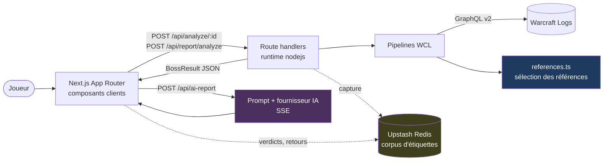

# Documentation LogLense

Ce dossier décrit **comment l'application fonctionne aujourd'hui**, telle qu'elle est dans
le code — pas telle qu'elle est cadrée. Le cadrage produit vit dans
[`PRODUCT_CONTEXT.md`](../PRODUCT_CONTEXT.md) et [`ia-ml-architecture.md`](../ia-ml-architecture.md) ;
si les deux divergent, c'est le code qui a raison ici.

| Fichier | Ce qu'il répond |
|---|---|
| [01-architecture.md](01-architecture.md) | Quelles couches existent, quelle route appelle quoi, et où sont les frontières |
| [02-ui-flows.md](02-ui-flows.md) | Ce que voit l'utilisateur, dans quel ordre, et quel état pilote quel écran |
| [03-comparabilite.md](03-comparabilite.md) | Comment les logs de référence sont choisis — le cœur du produit |
| [04-ia-et-ml.md](04-ia-et-ml.md) | Où le LLM intervient, où le ML n'intervient pas encore, et pourquoi |
| [05-capture-de-donnees.md](05-capture-de-donnees.md) | Le corpus d'étiquettes : ce qui est écrit, quand, et sous quelle identité |

## Le résumé en une image

Trois choses à retenir avant de lire le reste :

1. **Il y a deux chemins d'analyse, et un seul noyau.** Chemin personnage (nom → classements
   → meilleur parse) et chemin rapport (`code` + `actorId` déjà fournis). Ils ne diffèrent que
   sur *comment le sujet est trouvé* et *d'où viennent les percentiles*. Tout le reste passe
   par `combatant.ts`, `fight-data.ts` et `references.ts`.
2. **La valeur est dans la sélection des références, pas dans le texte du rapport.** Le LLM
   met en prose des tableaux déjà calculés. Retirez-le : les onglets Overview et Comparison
   tiennent encore debout. C'est la définition même du gadget au sens de `CLAUDE.md`.
3. **Aucun ML n'est en production.** Le produit *capture* de quoi en entraîner un ; il n'en
   exécute aucun. Voir [04-ia-et-ml.md](04-ia-et-ml.md), qui le dit sans détour.
