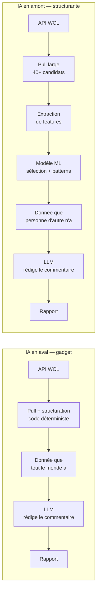
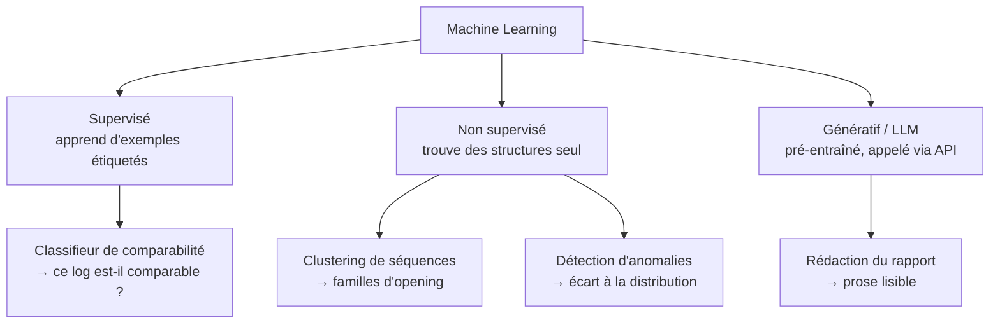
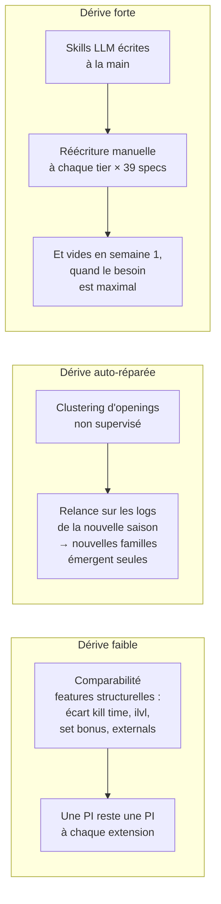
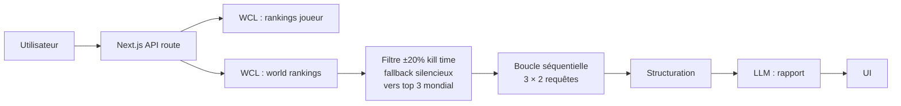
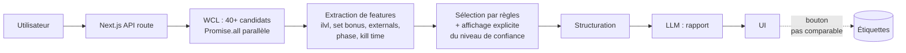
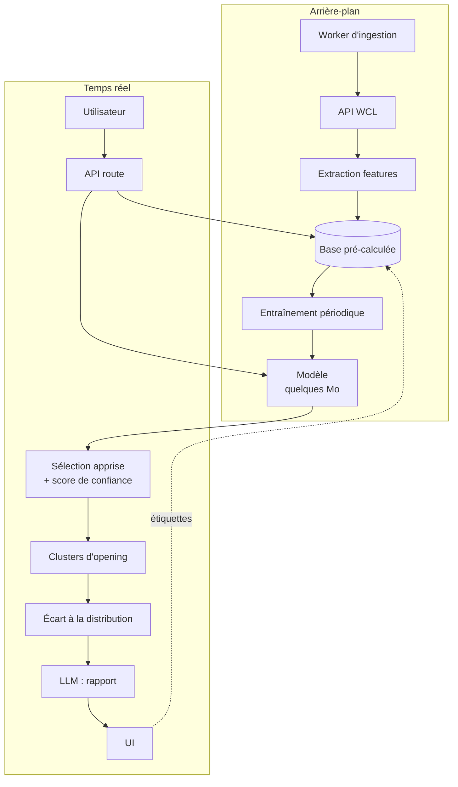
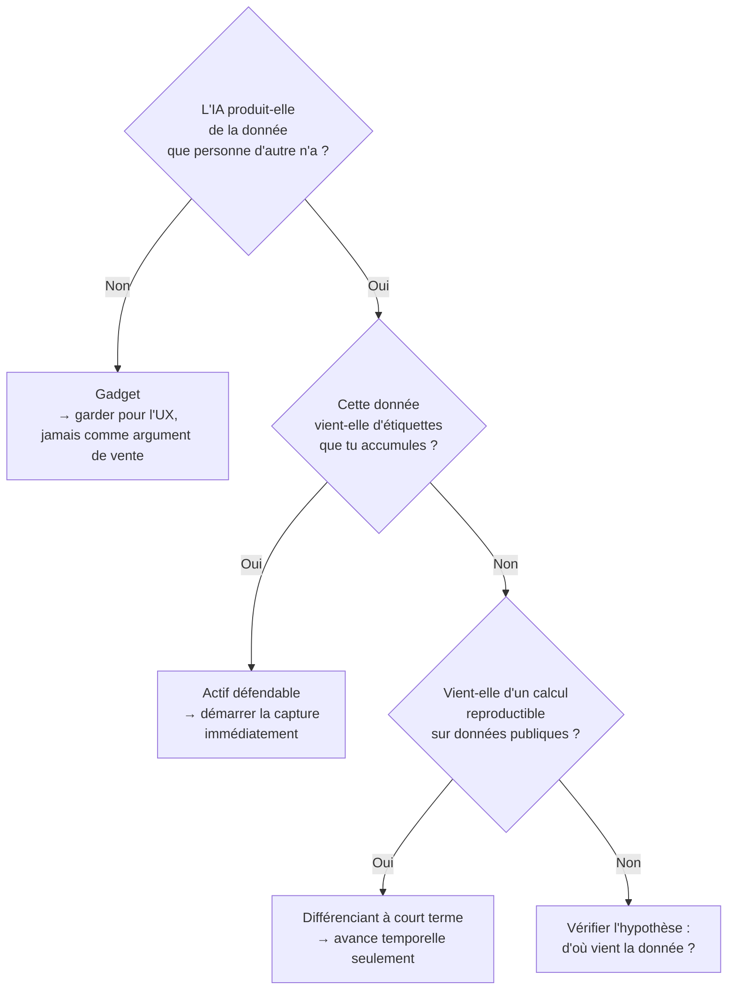

# IA structurante, familles de modèles et architectures

Note de synthèse — projet outil WoW monétisable.
Couvre : la distinction IA gadget / IA structurante, les familles de modèles ML,
et les architectures correspondantes.

---

## 1. IA gadget vs IA structurante

### Le test

> Retire l'IA du produit. S'il tient encore debout, l'IA était un gadget.

C'est le seul critère qui compte. Il ne porte pas sur la sophistication du modèle
mais sur sa **position dans la chaîne de valeur** : avant ou après la construction
de la donnée.

### Les deux positions

Dans le cas gadget, la valeur ajoutée est la prose. Elle se réplique en un week-end
par n'importe qui ayant accès à la même API publique.

Dans le cas structurant, la valeur ajoutée est **la donnée produite par le modèle**.
Le LLM final reste présent — il est utile pour l'UX — mais il n'est plus l'argument
de vente.

### Application au PoC actuel

| Composant | Position | Verdict |
|---|---|---|
| Pull WCL + structuration | Déterministe | Nécessaire, non différenciant |
| Filtre kill time (`KILL_TIME_TOLERANCE = 0.2`) | Seuil codé en dur | Réplicable en une ligne |
| Rapport de coaching LLM | Aval | **Gadget** |

Le rapport commente des agrégats (casts totaux, uptime, diff de talents) que
l'utilisateur peut lire lui-même dans l'onglet Comparison. C'est le cas gadget
au sens littéral.

---

## 2. Les familles de modèles

### Vue d'ensemble

### Comparaison économique

| | LLM via API | Modèle entraîné |
|---|---|---|
| Coût fixe | 0 | Collecte de données + entraînement |
| Coût par requête | Tokens — réel et récurrent | ~0 (quelques ms CPU) |
| Poids en production | Aucun (appel réseau) | Quelques Mo, chargé en mémoire |
| Latence | 1–10 s | < 10 ms |
| Ce que tu possèdes | Rien | Le modèle **et** les données |
| Réplicable par un concurrent | Oui, en un week-end | Non, sans tes données |
| Dérive saisonnière | Forte si connaissance métier écrite à la main | Faible si features structurelles |

### Le point central

**L'algorithme n'est jamais l'actif.** scikit-learn est public. Ce qui n'est pas
réplicable, c'est le **jeu de données étiqueté** — les décisions accumulées
"ce log est comparable / ne l'est pas".

Conséquence opérationnelle : la capture des étiquettes doit démarrer avant
l'entraînement, avant même de savoir si le modèle sera construit. Les données
non capturées sont perdues définitivement.

> **Repousse le calcul, jamais la capture.**

### Sur la dérive saisonnière

Objection courante : « à chaque tier, le modèle est périmé ».

Le problème décisif de l'approche knowledge-driven : en début de saison, la
connaissance experte **n'existe pas encore**. Les logs sont la seule source de
vérité disponible. Une approche data-driven fonctionne dès le premier soir du tier ;
une approche knowledge-driven attend qu'un tiers publie un guide — et redistribue
alors du gratuit.

---

## 3. Architectures

### v0 — état actuel (LogLense)

Caractéristiques : stateless, aucun stockage, aucun coût fixe.
Limites : fenêtre de candidats étroite, aucune donnée accumulée,
aucun actif constitué.

### v1 — cible court terme

Reste synchrone. Deux ajouts seulement.

Les deux ajouts qui comptent :

1. **Fenêtre de candidats élargie** — parallélisation, pas de changement d'archi.
2. **Capture des étiquettes** — une table, un endpoint, une insertion.
   Ne nécessite ni worker, ni pré-calcul.

Le fallback silencieux vers le top 3 mondial doit devenir visible : l'utilisateur
doit savoir quand la comparaison n'est pas légitime.

### v2 — cible avec ML

Ce qui change vraiment : le passage de « requête à la demande » à
**« pré-calcul en arrière-plan »**. La base pré-calculée est l'actif — elle sert
le ML, elle permet l'analyse instantanée d'un roster de 25 joueurs, et elle justifie
l'abonnement par une antériorité qu'un concurrent doit reconstituer.

### Coûts d'infra

| | v0 / v1 | v2 |
|---|---|---|
| Entraînement | — | Laptop ou GitHub Action, quelques secondes |
| Inférence ML | — | ~0, en mémoire |
| Inférence LLM | Tokens | Tokens |
| Stockage | ~0 | Postgres managé, quelques Go/an |
| Coût mensuel avant utilisateurs | ~0 | Quelques dizaines d'euros |

L'entraînement n'est pas le poste coûteux : données tabulaires, pas de deep learning,
pas de GPU. Le poste coûteux est le **pipeline de données**.

---

## 4. Arbre de décision

---

## 5. Points ouverts

- **Conditions d'utilisation de l'API WCL** sur le stockage et la redistribution
  de données dérivées. Une app qui requête à la demande et une app qui constitue
  une base dérivée ne sont pas nécessairement traitées de la même façon.
  À vérifier avant tout investissement en v2.
- **Volume d'étiquettes nécessaire** pour que le classifieur de comparabilité
  dépasse une heuristique simple. Inconnu tant que la capture n'a pas démarré.
- **Persona payeur** — joueur individuel ou raid leader. Détermine si la vue
  roster est une feature v2 ou le produit lui-même.
