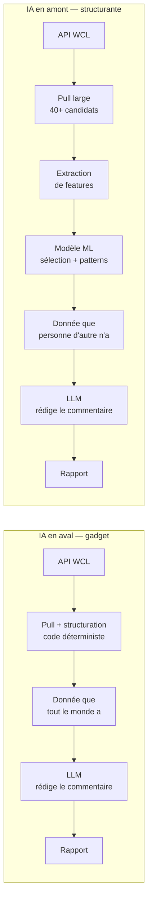
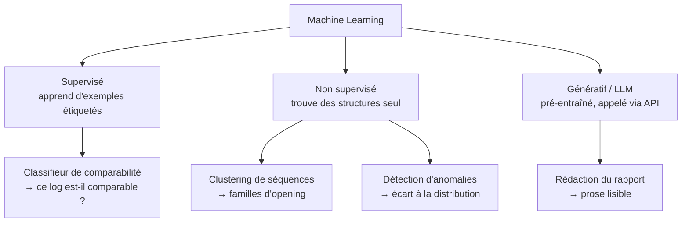
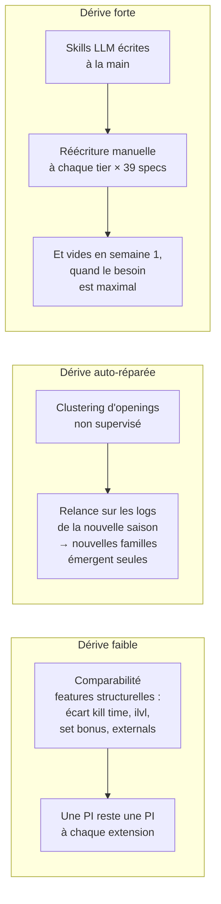
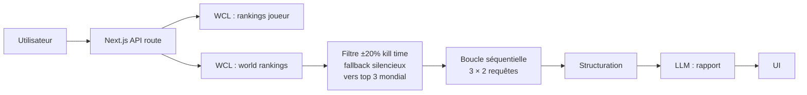
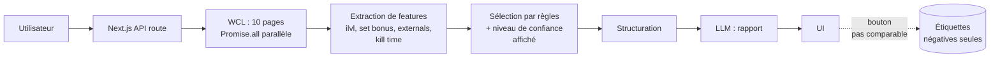
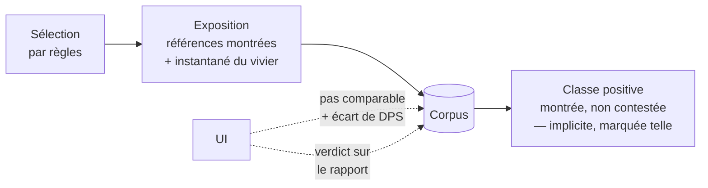
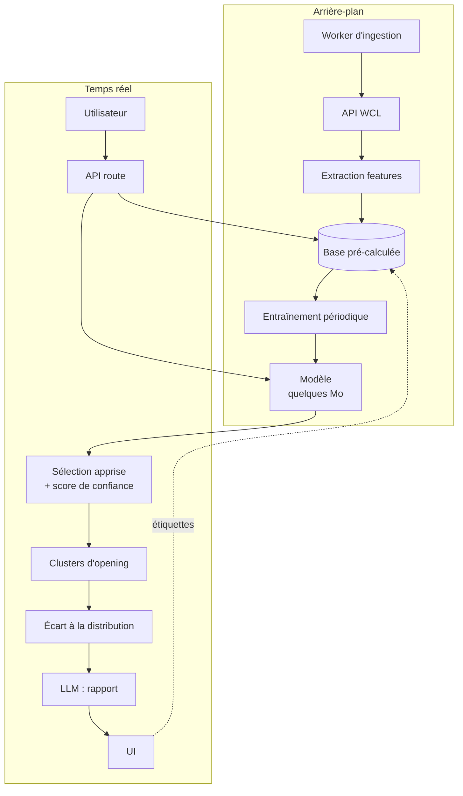
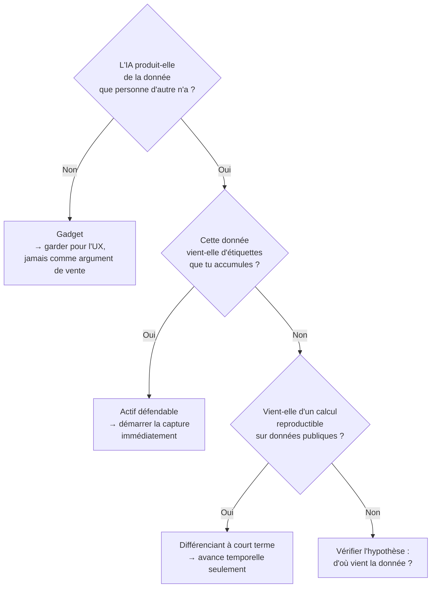

# IA structurante, familles de modèles et architectures

Note de synthèse — projet outil WoW monétisable.
Couvre : la distinction IA gadget / IA structurante, les familles de modèles ML,
et les architectures correspondantes.

---

## 1. IA gadget vs IA structurante

### Le test

> Retire l'IA du produit. S'il tient encore debout, l'IA était un gadget.

C'est le seul critère qui compte. Il ne porte pas sur la sophistication du modèle
mais sur sa **position dans la chaîne de valeur** : avant ou après la construction
de la donnée.

> **Révision du 2026-08-08.** Ce test était mal formé ; la section 6 en proposait le
> remplacement, et [CLAUDE.md](CLAUDE.md) l'a retenu — la contrainte n° 2 est reformulée
> en test de substitution (§6.1). La distinction position / sophistication, elle, tient.

### Les deux positions

Dans le cas gadget, la valeur ajoutée est la prose. Elle se réplique en un week-end
par n'importe qui ayant accès à la même API publique.

Dans le cas structurant, la valeur ajoutée est **la donnée produite par le modèle**.
Le LLM final reste présent — il est utile pour l'UX — mais il n'est plus l'argument
de vente.

### Application au PoC actuel

| Composant | Position | Verdict |
|---|---|---|
| Pull WCL + structuration | Déterministe | Nécessaire, non différenciant |
| Filtre kill time (`KILL_TIME_TOLERANCE = 0.2`) | Seuil codé en dur | Réplicable en une ligne |
| Rapport de coaching LLM | Aval | **Gadget** |

Le rapport commente des agrégats (casts totaux, uptime, diff de talents) que
l'utilisateur peut lire lui-même dans l'onglet Comparison. C'est le cas gadget
au sens littéral.

### Où en est la v1 après la décision du 2026-08-07

Le ML sort de la v1 et l'axe de fidélisation devient le suivi dans le temps.
Il faut passer le test au résultat, sans l'arranger.

| Composant de la v1 | Position | Verdict |
|---|---|---|
| Sélection par règles (distance, set bonus, externals) | Déterministe, en amont | Structurel, mais **réplicable** — c'est du seuil, pas du modèle |
| Suivi dans le temps | Déterministe, sur des parses publics | **Réplicable** — WCL garde l'historique, un concurrent le rebâtit à froid |
| Rapport de coaching LLM | Aval | **Gadget** |

**Retire l'IA de la v1 : elle tient encore debout.** La v1 échoue donc au test de la
contrainte n° 2, et ce n'est pas un accident de rédaction — c'est ce que la décision
coûte, assumé et daté. Voir la section 8 de
[PRODUCT_CONTEXT.md](PRODUCT_CONTEXT.md), « Le ML sort de la v1 ».

> **Révision du 2026-08-08.** Verdict rendu sous l'ancien test (nécessité fonctionnelle).
> Sous le test de substitution qui l'a remplacé (§6.1), la question devient : le rapport
> LLM fait-il mieux que le guide statique le moins cher ? Non encore répondue — voir
> « Ce qui rend l'IA structurante en v1 » dans les décisions ouvertes.

Une nuance, et une seule : le suivi dans le temps est réplicable **en tant que calcul**,
pas en tant que série. Un concurrent rebâtit la trajectoire de DPS d'un joueur ; il ne
rebâtit pas quel vivier de références existait en semaine 2 d'un tier, ni quel verdict de
comparabilité avait été rendu ce jour-là. Cette part-là périme avec la saison, et c'est
donc une **capture**, pas un calcul — elle relève de la règle ci-dessous, pas de celles
qu'on peut repousser.

Ce qui rend l'échec au test réversible est la capture, et rien d'autre. D'où l'ordre :
compléter la capture **avant** de construire le suivi.

---

## 2. Les familles de modèles

### Vue d'ensemble

### Comparaison économique

| | LLM via API | Modèle entraîné |
|---|---|---|
| Coût fixe | 0 | Collecte de données + entraînement |
| Coût par requête | Tokens — réel et récurrent | ~0 (quelques ms CPU) |
| Poids en production | Aucun (appel réseau) | Quelques Mo, chargé en mémoire |
| Latence | 1–10 s | < 10 ms |
| Ce que tu possèdes | Rien | Le modèle **et** les données |
| Réplicable par un concurrent | Oui, en un week-end | Non, sans tes données |
| Dérive saisonnière | Forte si connaissance métier écrite à la main | Faible si features structurelles |

> **Révision du 2026-08-08.** La ligne « réplicable par un concurrent » suppose qu'un
> concurrent veuille te répliquer. Personne n'a vérifié cette hypothèse ; à l'échelle
> visée elle est fausse. Voir section 6.2.

### Le point central

**L'algorithme n'est jamais l'actif.** scikit-learn est public. Ce qui n'est pas
réplicable, c'est le **jeu de données étiqueté** — les décisions accumulées
"ce log est comparable / ne l'est pas".

Conséquence opérationnelle : la capture des étiquettes doit démarrer avant
l'entraînement, avant même de savoir si le modèle sera construit. Les données
non capturées sont perdues définitivement.

> **Repousse le calcul, jamais la capture.**

### Sur la dérive saisonnière

Objection courante : « à chaque tier, le modèle est périmé ».

Le problème décisif de l'approche knowledge-driven : en début de saison, la
connaissance experte **n'existe pas encore**. Les logs sont la seule source de
vérité disponible. Une approche data-driven fonctionne dès le premier soir du tier ;
une approche knowledge-driven attend qu'un tiers publie un guide — et redistribue
alors du gratuit.

---

## 3. Architectures

### v0 — état actuel (LogLense)

Caractéristiques : stateless, aucun stockage, aucun coût fixe.
Limites : fenêtre de candidats étroite, aucune donnée accumulée,
aucun actif constitué.

### v1 — atteinte le 2026-08-06, sauf la capture

Reste synchrone. Les deux ajouts prévus sont faits : fenêtre de candidats élargie
(dix pages en parallèle) et capture des étiquettes (`POST /api/labels/comparability`,
liste mensuelle Redis). Le repli n'est plus silencieux : `ComparabilityBanner` énonce
le niveau atteint et les écarts signés.

Le trait pointillé est le seul lien qui alimente l'actif — et il ne transporte que des
refus. Ce qu'il manque pour que la v2 reste atteignable :

Trois trous, détaillés en section 8 de [PRODUCT_CONTEXT.md](PRODUCT_CONTEXT.md) :

1. **`subject.dps`** — le corpus porte le DPS de la référence, pas celui du sujet.
   L'écart, qui est la variable à expliquer, n'y est donc pas.
2. **Les références affichées-non-contestées** — sans elles, aucune classe positive :
   le classifieur de comparabilité est impossible, quel que soit le volume accumulé.
   C'est le trou bloquant.
3. **Un retour sur le rapport** — la seule mesure de l'hypothèse « le gratuit suffit »,
   et, couplée au suivi, l'amorce d'une étiquette « le conseil a-t-il fait progresser ».

L'exposition est écrite **côté serveur**, à la construction du rapport : un POST client
peut être perdu, et c'est ici toute la classe positive qui partirait avec.

### v2 — cible avec ML

Ce qui change vraiment : le passage de « requête à la demande » à
**« pré-calcul en arrière-plan »**. La base pré-calculée est l'actif — elle sert
le ML, elle permet l'analyse instantanée d'un roster de 25 joueurs, et elle justifie
l'abonnement par une antériorité qu'un concurrent doit reconstituer.

### Coûts d'infra

| | v0 / v1 | v2 |
|---|---|---|
| Entraînement | — | Laptop ou GitHub Action, quelques secondes |
| Inférence ML | — | ~0, en mémoire |
| Inférence LLM | Tokens | Tokens |
| Stockage | ~0 | Postgres managé, quelques Go/an |
| Coût mensuel avant utilisateurs | ~0 | Quelques dizaines d'euros |

L'entraînement n'est pas le poste coûteux : données tabulaires, pas de deep learning,
pas de GPU. Le poste coûteux est le **pipeline de données**.

---

## 4. Arbre de décision

---

## 5. Points ouverts

- ~~**Conditions d'utilisation de l'API WCL**~~ — **vérifié le 2026-08-07.** Réponse
  défavorable : §2a (approbation écrite pour tout usage commercial), §5d (pas de base
  permanente de contenu dérivé), §5c (pas d'exposition à des tiers sans opt-in). Le §2a se
  déclenche sur le revenu, pas sur l'apprentissage — retirer le ML ne lève rien. Décision :
  demander l'approbation en fin de projet, développer comme si elle était acquise. Texte
  intégral en section 8 de [PRODUCT_CONTEXT.md](PRODUCT_CONTEXT.md), « CGU RPGLogs ».
- ~~**Volume d'étiquettes nécessaire**~~ — **estimé le 2026-08-08**, voir section 6.6.
  Le chiffrer ne demandait pas la capture, seulement un ordre de grandeur : il tient, et
  il place le blocage sur le nombre d'utilisateurs, pas sur la donnée.
- ~~**Persona payeur**~~ — **tranché** : abonnement saisonnier de guilde, donc le raid
  leader. La section 4 de [PRODUCT_CONTEXT.md](PRODUCT_CONTEXT.md) fait autorité ; la vue
  roster est le produit à vendre, le moteur individuel est la phase de validation qualité.
- **Ce qui rend l'IA structurante en v1** — reste sans réponse depuis que le ML est sorti
  du périmètre. Aucune réponse n'est due tant que la capture progresse ; il en faudra une
  avant de facturer quoi que ce soit. La section 6.4 conteste que la question soit la
  bonne ; la contrainte n° 2 étant reformulée (§6.1, §6.7), la question à répondre est
  désormais celle du test de substitution, pas celle de la nécessité fonctionnelle.

---

## 6. Contre-arguments — 2026-08-08

Ce document est le résultat d'une réflexion menée en amont, pas une référence. Le texte
des sections 1 à 5 est conservé intact ; cette section dit où il est faux, trop fort, ou
appuyé sur une hypothèse jamais vérifiée. Deux choses en sortent renforcées : la
distinction position-dans-la-chaîne-de-valeur contre sophistication du modèle, et le
corollaire de capture.

### 6.1 Le test du gadget est mal formé

« Retire l'IA, si le produit tient encore debout, c'était un gadget » mesure la
**nécessité fonctionnelle**. Ce n'est pas ce qui compte. Retire la recommandation de
Spotify : il joue encore de la musique. Retire le classement de Google : il rend encore
des pages. Le test, appliqué à la lettre, est échoué par presque tout ce qui marche.

Trois questions distinctes sont fusionnées en une : le produit fonctionne-t-il sans,
l'IA crée-t-elle de la valeur marginale, et le résultat est-il coûteux à répliquer.

**Test de substitution, à lui préférer :**

> Remplace ton IA par le substitut le moins cher qui rende le même service — table de
> correspondance, seuils codés en dur, guide statique. L'utilisateur le remarque-t-il ?
> Part-il ?

Il discrimine, lui : il isole ce que l'IA apporte au-delà de l'alternative bête, ce que
le test d'origine ne fait jamais.

### 6.2 « Réplicable en un week-end » suppose un attaquant

Toute la défendabilité du document repose sur une menace jamais évaluée. À l'échelle
visée — quelques dizaines de guildes, 10 à 30 € la saison — **il n'y a rien à capturer,
donc personne n'écrit le clone du week-end.** La réplicabilité théorique est réelle ; sa
conséquence économique est nulle.

Le raisonnement a été mené comme si le projet visait un marché défendable, sans que cette
prémisse soit posée. Elle est fausse, et elle porte le tableau de la section 2.

### 6.3 La défendabilité n'a pas qu'une forme

Le document n'en connaît qu'une : modèle entraîné sur données propriétaires. Dans un
outil de niche, trois autres pèsent au moins autant.

| Fossé | Mécanisme | Coût |
|---|---|---|
| **Habitude** | Le rituel d'après-raid. Un outil consulté chaque mercredi n'est pas remplacé pour 10 % de mieux | Nul, mais lent |
| **Caution communautaire** | Être l'outil que les theorycrafters citent. Achète l'acquisition en même temps que la défense | Relationnel |
| **Donnée que WCL n'a pas** | Un addon in-game capture ce que le combat log ne contient pas : décisions, cibles disponibles au moment du choix, ce que le joueur voyait | Élevé — un second produit |

La troisième ligne mérite d'être posée sérieusement plutôt qu'écartée par omission : c'est
un fossé de données **sans une ligne de ML**, et il **contourne entièrement le problème
RPGLogs** puisque la donnée est la tienne — ni §2a, ni §5c, ni §5d. Que ce soit lourd est
une objection recevable ; ne l'avoir jamais envisagé est un angle mort.

### 6.4 Le verdict est peut-être une bonne nouvelle lue comme un échec

« Retire l'IA de la v1 : elle tient encore debout » est présenté comme un constat de
faillite. La lecture inverse se défend : tu as un produit **déterministe, auditable, à
coût marginal quasi nul**, dont la couche LLM est interchangeable et jetable.

Et dans ce domaine précis, c'est un avantage, pas un pis-aller. Le public cible est
hostile au flou : un raider confirmé vérifie tes chiffres. « Ta médiane de références est
à 640 d'ilvl, voici les douze logs » est plus solide qu'une prose générée qui peut
halluciner une interaction de sort. Le tort d'une hallucination n'est pas symétrique du
gain d'une jolie phrase.

Le document ne demande jamais si mettre l'IA au cœur est **souhaitable** ; il demande
seulement si c'est **atteint**. La contrainte n° 2 mérite donc une décision datée —
reformulée, ou retirée avec un motif — plutôt qu'un constat d'échec répété à chaque
section.

> **Révision du 2026-08-08.** Tranché : reformulée, pas retirée. [CLAUDE.md](CLAUDE.md)
> porte désormais le test de substitution du §6.1. Reste ouvert, et distinct de ce
> tranchage : si le rapport LLM de la v1 *passe* ce nouveau test — voir « Ce qui rend
> l'IA structurante en v1 » dans les décisions ouvertes ci-dessous.

### 6.5 La critique du knowledge-driven se retourne sur son propre critère

Section 2 écarte les règles écrites à la main parce qu'elles sont **vides en semaine 1**,
quand le besoin est maximal. Or l'approche data-driven est *plus* vide en semaine 1, pas
moins : elle a besoin d'une population de logs comparables qui n'existe pas encore, alors
qu'un theorycrafter écrit ses règles depuis le PTR, **avant** la sortie du tier.

L'argument est inversé sur l'axe même qui le porte. Et le contre-exemple tourne depuis des
années : WoWAnalyzer, entièrement knowledge-driven, est l'outil d'analyse individuelle le
plus utilisé.

Ce qui survit de la critique : la charge de maintenance × 39 specs, et la dépendance à ce
qu'un tiers publie du gratuit. Ce qui ne survit pas : « vide en semaine 1 ».

### 6.6 Le volume d'étiquettes était estimable, et il est atteignable

Le document traite la question comme insoluble avant la capture. Un ordre de grandeur
suffisait :

| Utilisateurs | Analyses / saison | Étiquettes / saison |
|---|---|---|
| 100 | 10 | 1 000 |
| 1 000 | 10 | 10 000 |

Pour un classifieur tabulaire à une quinzaine de features — écart de kill time, écart
d'ilvl, set bonus, externals — **10 000 exemples sont confortables, 1 000 sont déjà
exploitables.** Le ML est donc plus proche que le document ne le suppose.

Conséquence, et elle compte : **le blocage de la v2 n'est pas la donnée, c'est le nombre
d'utilisateurs.** Ce qui ramène à l'acquisition, traitée en section 9 de
[PRODUCT_CONTEXT.md](PRODUCT_CONTEXT.md).

### 6.7 Ce que ces contre-arguments changent

1. ~~**Trancher la contrainte n° 2** au lieu de la constater enfreinte : la reformuler
   — *l'IA doit créer de la valeur marginale, pas être nécessaire au fonctionnement* — ou
   la retirer avec une date et un motif.~~ — **tranché le 2026-08-08** : reformulée, voir
   [CLAUDE.md](CLAUDE.md) et §6.1.
2. **Substituer le test de 6.1** au test d'origine dans toute décision à venir.
3. **Ne pas justifier une décision par la défendabilité** tant que 6.2 n'est pas
   contredit par un chiffre d'utilisateurs.
4. **Garder le corollaire de capture**, dont aucun de ces points ne dépend : il tient sur
   la péremption saisonnière du vivier, pas sur la menace concurrentielle.
