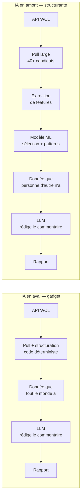
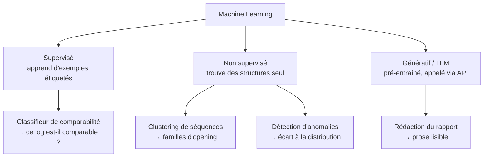
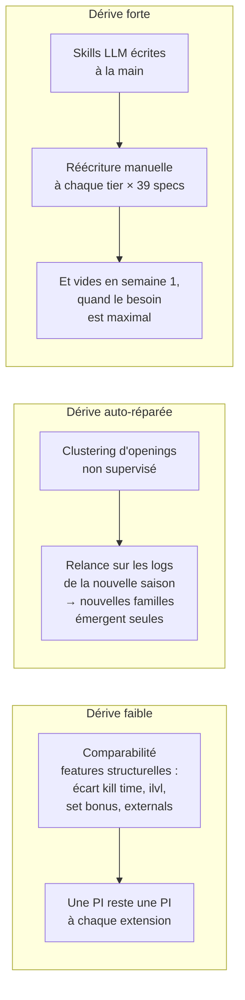
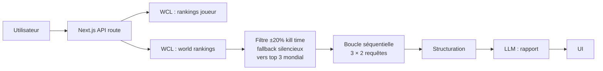
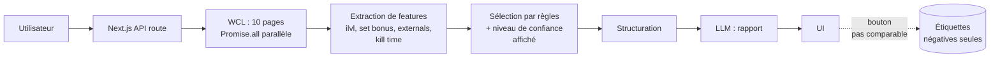
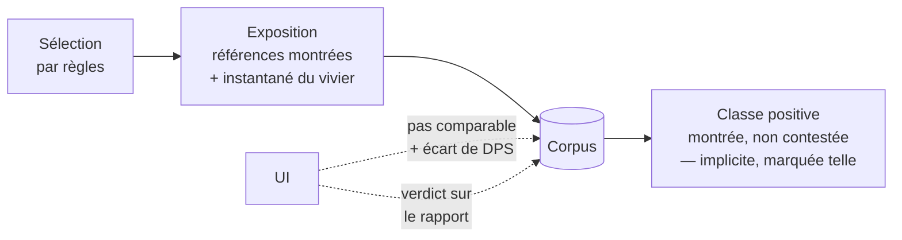
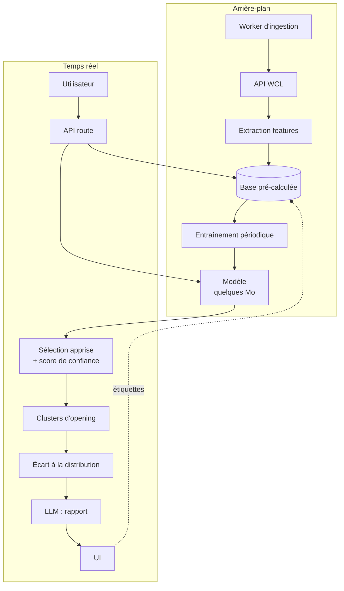
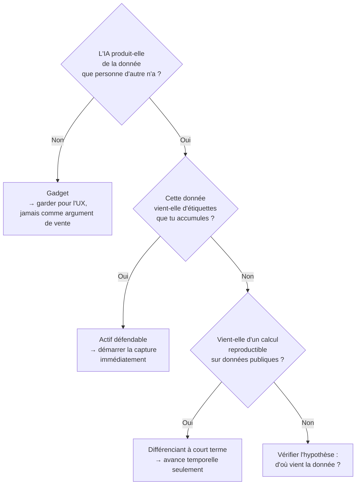

# IA structurante, familles de modèles et architectures

Note de synthèse — projet outil WoW monétisable.
Couvre : la distinction IA gadget / IA structurante, les familles de modèles ML,
et les architectures correspondantes.

---

## 1. IA gadget vs IA structurante

### Le test

> Retire l'IA du produit. S'il tient encore debout, l'IA était un gadget.

C'est le seul critère qui compte. Il ne porte pas sur la sophistication du modèle
mais sur sa **position dans la chaîne de valeur** : avant ou après la construction
de la donnée.

### Les deux positions

Dans le cas gadget, la valeur ajoutée est la prose. Elle se réplique en un week-end
par n'importe qui ayant accès à la même API publique.

Dans le cas structurant, la valeur ajoutée est **la donnée produite par le modèle**.
Le LLM final reste présent — il est utile pour l'UX — mais il n'est plus l'argument
de vente.

### Application au PoC actuel

| Composant | Position | Verdict |
|---|---|---|
| Pull WCL + structuration | Déterministe | Nécessaire, non différenciant |
| Filtre kill time (`KILL_TIME_TOLERANCE = 0.2`) | Seuil codé en dur | Réplicable en une ligne |
| Rapport de coaching LLM | Aval | **Gadget** |

Le rapport commente des agrégats (casts totaux, uptime, diff de talents) que
l'utilisateur peut lire lui-même dans l'onglet Comparison. C'est le cas gadget
au sens littéral.

### Où en est la v1 après la décision du 2026-08-07

Le ML sort de la v1 et l'axe de fidélisation devient le suivi dans le temps.
Il faut passer le test au résultat, sans l'arranger.

| Composant de la v1 | Position | Verdict |
|---|---|---|
| Sélection par règles (distance, set bonus, externals) | Déterministe, en amont | Structurel, mais **réplicable** — c'est du seuil, pas du modèle |
| Suivi dans le temps | Déterministe, sur des parses publics | **Réplicable** — WCL garde l'historique, un concurrent le rebâtit à froid |
| Rapport de coaching LLM | Aval | **Gadget** |

**Retire l'IA de la v1 : elle tient encore debout.** La v1 échoue donc au test de la
contrainte n° 2, et ce n'est pas un accident de rédaction — c'est ce que la décision
coûte, assumé et daté. Voir la section 8 de
[PRODUCT_CONTEXT.md](PRODUCT_CONTEXT.md), « Le ML sort de la v1 ».

Une nuance, et une seule : le suivi dans le temps est réplicable **en tant que calcul**,
pas en tant que série. Un concurrent rebâtit la trajectoire de DPS d'un joueur ; il ne
rebâtit pas quel vivier de références existait en semaine 2 d'un tier, ni quel verdict de
comparabilité avait été rendu ce jour-là. Cette part-là périme avec la saison, et c'est
donc une **capture**, pas un calcul — elle relève de la règle ci-dessous, pas de celles
qu'on peut repousser.

Ce qui rend l'échec au test réversible est la capture, et rien d'autre. D'où l'ordre :
compléter la capture **avant** de construire le suivi.

---

## 2. Les familles de modèles

### Vue d'ensemble

### Comparaison économique

| | LLM via API | Modèle entraîné |
|---|---|---|
| Coût fixe | 0 | Collecte de données + entraînement |
| Coût par requête | Tokens — réel et récurrent | ~0 (quelques ms CPU) |
| Poids en production | Aucun (appel réseau) | Quelques Mo, chargé en mémoire |
| Latence | 1–10 s | < 10 ms |
| Ce que tu possèdes | Rien | Le modèle **et** les données |
| Réplicable par un concurrent | Oui, en un week-end | Non, sans tes données |
| Dérive saisonnière | Forte si connaissance métier écrite à la main | Faible si features structurelles |

### Le point central

**L'algorithme n'est jamais l'actif.** scikit-learn est public. Ce qui n'est pas
réplicable, c'est le **jeu de données étiqueté** — les décisions accumulées
"ce log est comparable / ne l'est pas".

Conséquence opérationnelle : la capture des étiquettes doit démarrer avant
l'entraînement, avant même de savoir si le modèle sera construit. Les données
non capturées sont perdues définitivement.

> **Repousse le calcul, jamais la capture.**

### Sur la dérive saisonnière

Objection courante : « à chaque tier, le modèle est périmé ».

Le problème décisif de l'approche knowledge-driven : en début de saison, la
connaissance experte **n'existe pas encore**. Les logs sont la seule source de
vérité disponible. Une approche data-driven fonctionne dès le premier soir du tier ;
une approche knowledge-driven attend qu'un tiers publie un guide — et redistribue
alors du gratuit.

---

## 3. Architectures

### v0 — état actuel (LogLense)

Caractéristiques : stateless, aucun stockage, aucun coût fixe.
Limites : fenêtre de candidats étroite, aucune donnée accumulée,
aucun actif constitué.

### v1 — atteinte le 2026-08-06, sauf la capture

Reste synchrone. Les deux ajouts prévus sont faits : fenêtre de candidats élargie
(dix pages en parallèle) et capture des étiquettes (`POST /api/labels/comparability`,
liste mensuelle Redis). Le repli n'est plus silencieux : `ComparabilityBanner` énonce
le niveau atteint et les écarts signés.

Le trait pointillé est le seul lien qui alimente l'actif — et il ne transporte que des
refus. Ce qu'il manque pour que la v2 reste atteignable :

Trois trous, détaillés en section 8 de [PRODUCT_CONTEXT.md](PRODUCT_CONTEXT.md) :

1. **`subject.dps`** — le corpus porte le DPS de la référence, pas celui du sujet.
   L'écart, qui est la variable à expliquer, n'y est donc pas.
2. **Les références affichées-non-contestées** — sans elles, aucune classe positive :
   le classifieur de comparabilité est impossible, quel que soit le volume accumulé.
   C'est le trou bloquant.
3. **Un retour sur le rapport** — la seule mesure de l'hypothèse « le gratuit suffit »,
   et, couplée au suivi, l'amorce d'une étiquette « le conseil a-t-il fait progresser ».

L'exposition est écrite **côté serveur**, à la construction du rapport : un POST client
peut être perdu, et c'est ici toute la classe positive qui partirait avec.

### v2 — cible avec ML

Ce qui change vraiment : le passage de « requête à la demande » à
**« pré-calcul en arrière-plan »**. La base pré-calculée est l'actif — elle sert
le ML, elle permet l'analyse instantanée d'un roster de 25 joueurs, et elle justifie
l'abonnement par une antériorité qu'un concurrent doit reconstituer.

### Coûts d'infra

| | v0 / v1 | v2 |
|---|---|---|
| Entraînement | — | Laptop ou GitHub Action, quelques secondes |
| Inférence ML | — | ~0, en mémoire |
| Inférence LLM | Tokens | Tokens |
| Stockage | ~0 | Postgres managé, quelques Go/an |
| Coût mensuel avant utilisateurs | ~0 | Quelques dizaines d'euros |

L'entraînement n'est pas le poste coûteux : données tabulaires, pas de deep learning,
pas de GPU. Le poste coûteux est le **pipeline de données**.

---

## 4. Arbre de décision

---

## 5. Points ouverts

- ~~**Conditions d'utilisation de l'API WCL**~~ — **vérifié le 2026-08-07.** Réponse
  défavorable : §2a (approbation écrite pour tout usage commercial), §5d (pas de base
  permanente de contenu dérivé), §5c (pas d'exposition à des tiers sans opt-in). Le §2a se
  déclenche sur le revenu, pas sur l'apprentissage — retirer le ML ne lève rien. Décision :
  demander l'approbation en fin de projet, développer comme si elle était acquise. Texte
  intégral en section 8 de [PRODUCT_CONTEXT.md](PRODUCT_CONTEXT.md), « CGU RPGLogs ».
- **Volume d'étiquettes nécessaire** pour que le classifieur de comparabilité
  dépasse une heuristique simple. Toujours inconnu, et la question ne se pose pas
  utilement avant que la classe positive soit capturée.
- ~~**Persona payeur**~~ — **tranché** : abonnement saisonnier de guilde, donc le raid
  leader. La section 4 de [PRODUCT_CONTEXT.md](PRODUCT_CONTEXT.md) fait autorité ; la vue
  roster est le produit à vendre, le moteur individuel est la phase de validation qualité.
- **Ce qui rend l'IA structurante en v1** — reste sans réponse depuis que le ML est sorti
  du périmètre. Aucune réponse n'est due tant que la capture progresse ; il en faudra une
  avant de facturer quoi que ce soit.
